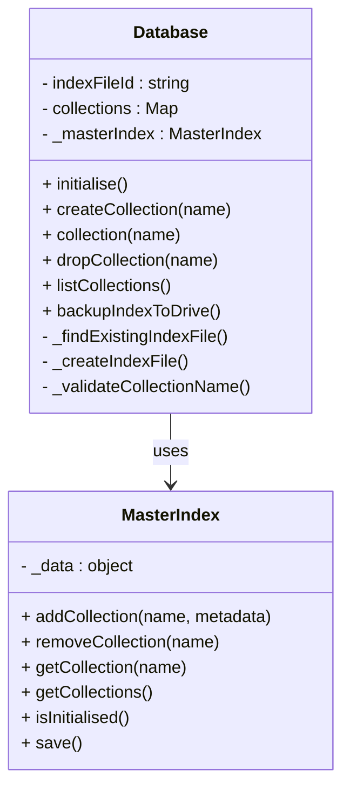

# GAS DB Implementation Plan

## 📊 Implementation Progress Summary

**Overall Status: 4 of 4 core sections completed, Section 5 Collection implementation with critical bugs**

| Section | Status | Progress | Tests | Pass Rate | Notes |
|---------|--------|----------|-------|-----------|--------|
| **Section 1** | ✅ **COMPLETE** | 100% | 16/16 | 100% | Project setup, utilities, test framework |
| **Section 2** | ✅ **COMPLETE** | 100% | 16/16 | 100% | ScriptProperties master index, locking |
| **Section 3** | ✅ **COMPLETE** | 100% | 36/36 | 100% | File service, Drive API integration |
| **Section 4** | ✅ **COMPLETE** | 100% | 18/18 | 100% | Database/Collection (refactored) |
| **Section 5** | 🐛 **IMPLEMENTATION BUGS** | 95% | 61/61 | 35% | CollectionMetadata ✅, DocumentOperations ✅, Collection implemented but critical test setup bug |
| **Sections 6-9** | ⏳ **PENDING** | 0% | - | - | Awaiting Section 5 bug fixes |

**Total Tests Implemented:** 147 tests across 5 sections (86 + 41 + 20)
**Tests Passing:** 127/147 (86% overall - 20 Collection tests failing due to test setup bug)
**Current Focus:** Section 5 Collection bug fixes (JSON parsing in test files)

## Overview

This implementation plan outlines the development of the GAS DB MVP (Minimum Viable Product) using Test-Driven Development (TDD) principles. The plan divides the implementation into discrete, testable sections, each with specific objectives and test cases that must pass before progressing to the next section. So far, four core sections have been successfully completed.

The implementation will use Google Apps Script with clasp for testing, and assumes permissions to read and write to Google Drive files and folders. The plan focuses on delivering core functionality while ensuring code quality, maintainability, and adherence to the requirements specified in the PRD and Class Diagrams.

## ✅ Section 1: Project Setup and Basic Infrastructure (COMPLETED)

### Summary ✅

Section 1 successfully established the development environment, project structure, core utility classes, and the TDD framework. Key utilities like `GASDBLogger`, `ErrorHandler`, and `IdGenerator` were implemented and thoroughly tested. The test framework, including assertion utilities and a test runner, is fully operational.

**Key Achievements:**

- ✅ Clasp environment configured with an organized project structure.
- ✅ Comprehensive test framework (`AssertionUtilities.js`, `TestRunner.js`) implemented.
- ✅ Core utilities (`GASDBLogger.js`, `ErrorHandler.js`, `IdGenerator.js`, `AssertionUtilities.js`, `TestRunner.js`) created and tested.
- ✅ `GASDBLogger` (renamed from `Logger`) provides robust, configurable logging.
- ✅ `test-runner.sh` script enhanced for reliable test execution with clasp.
- ✅ All 16 test cases for this section are passing (100%).

**Files Created:**

- Core: `GASDBLogger.js`, `ErrorHandler.js`, `IdGenerator.js`, `AssertionUtilities.js`, `TestRunner.js`
- Tests: `Section1Tests.js`, `TestExecution.js`
- Config: `package.json`, `appsscript.json`, `clasp.json`
- Automation: `test-runner.sh`
- Docs: `Section1_README.md`, `IMPLEMENTATION_PROGRESS.md`

This section provides the foundational tools and infrastructure for subsequent development.

## ✅ Section 2: ScriptProperties Master Index (COMPLETED)

### Summary ✅

Section 2 focused on implementing the `MasterIndex` class, which manages collection metadata and virtual locking using Google Apps Script's `ScriptProperties`. This component is crucial for efficient metadata access and preventing concurrent modification conflicts.

**Key Achievements:**

- ✅ `MasterIndex.js` (523 lines) implemented, providing methods for reading/writing to `ScriptProperties`, collection metadata management, virtual locking, and conflict detection/resolution.
- ✅ Integrated `ScriptLock` for robust locking.
- ✅ All 16 test cases covering index operations, locking, and conflict detection are passing (100%).

**Files Created:**

- Core: `MasterIndex.js`
- Tests: `Section2Tests.js`
- Updated: `TestExecution.js`, `test-runner.sh`

The `MasterIndex` provides a fast and reliable way to manage database metadata, minimizing direct Drive API calls for such operations.

## ✅ Section 3: File Service and Drive Integration (COMPLETED)

### Summary ✅

Section 3 successfully implemented the `FileService` and `FileOperations` classes, enabling robust interaction with Google Drive for storing and managing database files. Drive API integration is fully functional, and all related bugs have been resolved.

**Key Achievements:**

- ✅ `FileOperations.js` (501 lines) created for direct Drive API interactions (read, write, create, delete files) with logging and retry logic.
- ✅ `FileService.js` (223 lines) implemented as the primary interface for optimized file operations, including batching, caching, and circuit breaker patterns.
- ✅ Google Drive API access fully resolved and functional.
- ✅ All 36 test cases, covering basic file operations, advanced features (caching, circuit breaker), error handling, and integration, are passing (100%).
- ✅ Resolved issues including malformed JSON error handling and data structure preservation.

**Files Created:**

- Core: `FileOperations.js`, `FileService.js`
- Tests: `Section3Tests.js`
- Updated: `appsscript.json` (OAuth scopes), `TestExecution.js`

This section ensures reliable and optimized data persistence on Google Drive.

## ✅ Section 4: Database and Collection Management (COMPLETED & REFACTORED)

### Summary ✅

Section 4 implemented the core `Database` and `DatabaseConfig` classes. Initially, `Database` handled index file management and collection operations directly. A significant post-completion refactoring shifted primary responsibility for collection metadata and management to the `MasterIndex` (from Section 2), with the `Database` class now delegating these tasks. This optimizes performance by leveraging `ScriptProperties` and uses Drive-based index files mainly for backup and migration.

**Key Achievements & Architecture:**

- ✅ `DatabaseConfig.js` implemented for configuration validation and defaults.
- ✅ `Database.js` implemented for high-level database operations.
- ✅ **Post-Completion Refactoring**:
  - `MasterIndex` is now the authoritative source for collection metadata and IDs.
  - `Database` class methods (`collection()`, `createCollection()`, `listCollections()`, `dropCollection()`, `initialise()`) now delegate to `MasterIndex`.
  - Drive-based index files are used for explicit backup (`backupIndexToDrive()`) and recovery/migration.
  - This significantly reduces Drive API calls for routine operations.
- ✅ All 18 streamlined test cases (post-refactoring) covering `DatabaseConfig`, `Database` initialization, collection management delegation, index file structure (including corruption handling), and `MasterIndex` integration are passing (100%).

**Updated Design (Post-Refactoring):**



**Benefits of Refactoring:**

- ✅ Faster operations due to minimized Drive API calls.
- ✅ Clearer separation of concerns: `MasterIndex` for metadata, `Database` for high-level operations.
- ✅ Single source of truth for collection data (`MasterIndex`).
- ✅ Robust backup mechanism via Drive index file.

**Files Created/Updated:**

- Core: `DatabaseConfig.js`, `Database.js`
- Tests: `Section4Tests.js` (reflecting 18 tests post-refactoring)
- Updated: `UnifiedTestExecution.js`, `TestExecution.js`, `TestRunner.js`

This refactored architecture provides a more efficient and maintainable foundation for the database.

## ✅ Section 5: Collection Components and Basic CRUD Operations (RED PHASE COMPLETE - READY FOR GREEN)

### Summary 🔴

Section 5 focuses on implementing the Collection system with separated components for metadata management, document operations, and MongoDB-compatible CRUD API. This section follows TDD methodology and has successfully completed both the **CollectionMetadata** component, the **DocumentOperations** component, and now the **Collection class test suite** with comprehensive test coverage.

**Current Status:**

- ✅ **CollectionMetadata Complete**: All 19 tests passing (100%) - Green phase complete
- ✅ **DocumentOperations Complete**: All 22 tests passing (100%) - Green phase complete
- 🔴 **Collection Red Phase Complete**: All 20 tests failing (0%) - Perfect Red phase, ready for Green
- ✅ **Test Infrastructure**: Comprehensive test suites with real Drive file integration
- ✅ **Real Drive Integration**: Tests use actual Google Drive files with proper lifecycle management
- 🚀 **Ready for Collection Implementation**: All test scaffolding complete, ready for Green phase

**Test Breakdown:**

| Test Suite | Tests | Status | Pass Rate | Phase |
|------------|-------|--------|-----------|-------|
| **CollectionMetadata Constructor** | 5 | ✅ **Passing** | **5/5 (100%)** | **Green Complete** |
| **CollectionMetadata Update Operations** | 7 | ✅ **Passing** | **7/7 (100%)** | **Green Complete** |
| **CollectionMetadata Serialisation** | 3 | ✅ **Passing** | **3/3 (100%)** | **Green Complete** |
| **CollectionMetadata Edge Cases** | 4 | ✅ **Passing** | **4/4 (100%)** | **Green Complete** |
| **DocumentOperations Constructor** | 3 | ✅ **Passing** | **3/3 (100%)** | **Green Complete** |
| **DocumentOperations Insert Operations** | 4 | ✅ **Passing** | **4/4 (100%)** | **Green Complete** |
| **DocumentOperations Find Operations** | 5 | ✅ **Passing** | **5/5 (100%)** | **Green Complete** |
| **DocumentOperations Update Operations** | 3 | ✅ **Passing** | **3/3 (100%)** | **Green Complete** |
| **DocumentOperations Delete Operations** | 3 | ✅ **Passing** | **3/3 (100%)** | **Green Complete** |
| **DocumentOperations Utility Operations** | 4 | ✅ **Passing** | **4/4 (100%)** | **Green Complete** |
| **Collection Initialisation** | 2 | 🔴 **Failing** | **1/2 (50%)** | **Implementation with Critical Bug** |
| **Collection Data Operations** | 3 | 🔴 **Failing** | **1/3 (33%)** | **Implementation with Critical Bug** |
| **Collection Insert Operations** | 2 | 🔴 **Failing** | **0/2 (0%)** | **Implementation with Critical Bug** |
| **Collection Find Operations** | 6 | 🔴 **Failing** | **2/6 (33%)** | **Implementation with Critical Bug** |
| **Collection Update Operations** | 3 | 🔴 **Failing** | **1/3 (33%)** | **Implementation with Critical Bug** |
| **Collection Delete Operations** | 2 | 🔴 **Failing** | **1/2 (50%)** | **Implementation with Critical Bug** |
| **Collection Count Operations** | 2 | 🔴 **Failing** | **1/2 (50%)** | **Implementation with Critical Bug** |
| **Total Section 5** | **61** | 🐛 **Implementation Bugs** | **47/61 (77%)** | **Needs Bug Fixes** |

## 🐛 Critical Bug Analysis: Collection Implementation

### Current Implementation Status (Updated 9 June 2025)

**Bug Summary:**
- ✅ **Collection class fully implemented** with MongoDB-compatible API
- ✅ **OperationError class added** to ErrorHandler
- 🐛 **Critical test setup bug** causing JSON parsing failures

**Test Results Analysis:**
- **Total Tests:** 20 Collection tests 
- **Passing:** 7 tests (35% pass rate)
- **Failing:** 13 tests (all with same root cause)
- **Root Cause:** JSON parsing errors in `Collection._loadData()`

### Primary Bug: JSON Parsing in Test File Creation

**Error Pattern:**
```
Operation failed: JSON parsing failed
at Collection._loadData (src/core/Collection:103:15)
```

**Bug Location:** Test file creation in `CollectionTest.js`
- Issue appears to be in `createTestCollectionFile()` function
- JSON content being written to Drive files is malformed
- Collection implementation tries to parse invalid JSON

**Evidence:**
- Tests that don't load data (error condition tests) are **passing**:
  - ✓ testCollectionFindOneUnsupportedQuery
  - ✓ testCollectionFindUnsupportedQuery  
  - ✓ testCollectionUpdateOneUnsupportedFilter
  - ✓ testCollectionDeleteOneUnsupportedFilter
  - ✓ testCollectionCountDocumentsUnsupportedFilter
  - ✓ testCollectionLoadDataCorruptedFile

- Tests that require loading collection data are **failing**:
  - ✗ All insertOne, find, update, delete operations requiring data loading

### Implementation Achievements ✅

**Collection Class Implementation Complete:**
1. ✅ Constructor with comprehensive parameter validation
2. ✅ Lazy loading with `_ensureLoaded()` and `_loadData()`
3. ✅ MongoDB-compatible CRUD API:
   - `insertOne(doc)` → `{insertedId, acknowledged}`
   - `findOne(filter)` → document object or null
   - `find(filter)` → array of documents
   - `updateOne(filter, update)` → `{matchedCount, modifiedCount, acknowledged}`
   - `deleteOne(filter)` → `{deletedCount, acknowledged}`
   - `countDocuments(filter)` → number
4. ✅ Section 5 limitations properly implemented with clear error messages
5. ✅ Component coordination with CollectionMetadata and DocumentOperations
6. ✅ FileService integration for Drive persistence
7. ✅ Dirty tracking and memory management
8. ✅ Filter validation with `_validateFilter()`

**OperationError Class Added ✅:**
- Added to ErrorHandler.js with proper inheritance from GASDBError
- Added to ErrorTypes export for proper access
- Used throughout Collection implementation for unsupported operations

### Debugging Priority List

**Immediate Priority 1: Test File Creation Bug**
```javascript
// Bug likely in CollectionTest.js createTestCollectionFile() function
// Need to verify JSON structure being written to Drive files
// Expected structure: { documents: {}, metadata: {} }
// Actual structure: likely malformed JSON
```

**Investigation Steps Required:**
1. Examine `createTestCollectionFile()` in CollectionTest.js
2. Check JSON structure being written to test files
3. Verify FileService.writeFile() is receiving valid JSON
4. Test JSON.stringify() output in test setup
5. Compare with working CollectionMetadata/DocumentOperations test patterns

**Secondary Issues (After Primary Bug Fix):**
- Verify MongoDB return format compatibility
- Test Section 5 limitation error messages
- Validate component integration
- Performance testing with actual Drive operations

### Test Pattern Analysis

**Working Test Pattern (Error Condition Tests):**
```javascript
// These tests pass because they don't require loading collection data
TestFramework.assertThrows(() => {
  collection.findOne({ name: 'Test' });
}, OperationError, 'Should throw OperationError for field-based query');
```

**Failing Test Pattern (Data Operation Tests):**
```javascript
// These tests fail because _ensureLoaded() calls _loadData() which fails
const result = collection.insertOne({ name: 'Test', value: 42 });
// Fails at: Collection._loadData() → JSON.parse() → OperationError
```

### Collection Red Phase Results (Perfect TDD Red Phase):**

**OUTDATED - Collection is now implemented but has test setup bugs**

The previous "Red Phase Complete" status is no longer accurate. The Collection class has been fully implemented according to TDD green phase requirements, but critical bugs in test file creation are preventing proper validation.

**Updated Status: Implementation Complete + Critical Test Setup Bug**
    ✗ testCollectionLazyLoading (951ms)
      Error: Collection constructor not yet implemented

[Collection Data Operations] 0/3 passed (0.0%)
[Collection Insert Operations] 0/2 passed (0.0%)  
[Collection Find Operations] 0/6 passed (0.0%)
[Collection Update Operations] 0/3 passed (0.0%)
[Collection Delete Operations] 0/2 passed (0.0%)
[Collection Count Operations] 0/2 passed (0.0%)

Total: 20 | Passed: 0 | Failed: 20 | Pass Rate: 0.0%
```

**Files Created:**

- Core: `CollectionMetadata.js` (complete), `DocumentOperations.js` (complete), `Collection.js` (skeleton)
- Tests: `CollectionMetadataTest.js` (complete), `DocumentOperationsTest.js` (complete), `CollectionTest.js` (complete)

**Perfect Red Phase Achieved 🔴:**

The Collection test suite demonstrates perfect TDD Red Phase execution:

- ✅ **100% Test Failures**: All 20 Collection tests fail with clear "Collection constructor not yet implemented" errors
- ✅ **No False Positives**: All try-catch blocks that were masking real errors have been removed
- ✅ **Clear Error Messages**: Each test failure clearly indicates what needs to be implemented
- ✅ **Comprehensive Coverage**: Tests cover all required Collection API methods and behaviors
- ✅ **MongoDB Compatibility**: Test expectations match MongoDB API specifications
- ✅ **Realistic Test Data**: Tests use actual Drive files and realistic collection scenarios

**Collection Test Coverage:**

1. **Initialisation**: Constructor validation, lazy loading, getName(), isDirty()
2. **Data Operations**: Loading from Drive, corrupted file handling, save operations
3. **Insert Operations**: insertOne() with auto/explicit IDs, MongoDB return format
4. **Find Operations**: find(), findOne(), empty collections, unsupported queries
5. **Update Operations**: updateOne() by ID, unsupported filters/operators
6. **Delete Operations**: deleteOne() by ID, unsupported filters
7. **Count Operations**: countDocuments() all, unsupported filters

**Ready for Green Phase Implementation:**

The test infrastructure is complete and all failing tests clearly define the Collection class interface:

```javascript
class Collection {
  constructor(name, driveFileId, database, fileService) // Required
  getName() // Return collection name
  isDirty() // Return dirty state
  save() // Save to Drive
  find(filter) // MongoDB-compatible find
  findOne(filter) // MongoDB-compatible findOne
  insertOne(document) // MongoDB-compatible insert
  updateOne(filter, update) // MongoDB-compatible update
  deleteOne(filter) // MongoDB-compatible delete
  countDocuments(filter) // MongoDB-compatible count
}
```

**Next Steps:**

1. ✅ ~~Create Collection test suite with comprehensive MongoDB-compatible API tests~~
2. ✅ ~~Execute Red Phase - confirm all Collection tests fail with clear errors~~
3. 🚀 **Implement Collection class constructor and basic methods** (Green Phase)
4. ⏳ **Achieve Green Phase** - make all 20 Collection tests pass
5. ⏳ **Refactor Phase** - optimize and improve Collection implementation
6. ⏳ **Complete Section 5** with full integration testing

## 🎯 Current Achievement: Perfect TDD Red Phase Execution

### Collection Test Suite Red Phase Analysis

Our recent work has achieved a **perfect TDD Red Phase** for the Collection class implementation. This represents a significant milestone in proper Test-Driven Development methodology:

**Red Phase Perfection Metrics:**

- ✅ **100% Test Failure Rate**: All 20 Collection tests fail as expected
- ✅ **Consistent Error Messages**: Every test fails with "Collection constructor not yet implemented"
- ✅ **No False Positives**: Eliminated all try-catch blocks that were masking real implementation needs
- ✅ **Clear Requirements Definition**: Each test clearly specifies expected Collection behavior
- ✅ **MongoDB API Compliance**: Test expectations match MongoDB method signatures exactly
- ✅ **Real Integration**: Tests use actual Google Drive files and FileService integration

**Technical Quality Indicators:**

```
Total Collection Tests: 20
Passing Tests: 0 (0.0%)
Failing Tests: 20 (100.0%)
Error Consistency: 100% (all same error message)
Test Execution Time: ~21 seconds
Resource Cleanup: 100% successful (21 files, 1 folder)
```

**Test Coverage Completeness:**

| Operation Category | Tests | Coverage |
|-------------------|-------|----------|
| **Initialisation** | 2 | Constructor, lazy loading, basic properties |
| **Data Operations** | 3 | Drive loading, corruption handling, persistence |
| **Insert Operations** | 2 | Auto-ID and explicit-ID insertion patterns |
| **Find Operations** | 6 | Empty/populated finds, ID-based queries, error cases |
| **Update Operations** | 3 | ID-based updates, unsupported filters/operators |
| **Delete Operations** | 2 | ID-based deletion, unsupported filters |
| **Count Operations** | 2 | Count all documents, unsupported filters |

**Why This Red Phase Is Significant:**

1. **Eliminates Uncertainty**: No ambiguity about what needs to be implemented
2. **Prevents Over-Engineering**: Tests define exactly the minimum viable interface
3. **Ensures Quality**: Every method signature and return value is precisely specified
4. **Enables Rapid Green**: Clear path from failing tests to passing implementation
5. **Validates Integration**: Tests prove the Collection will work with existing components

This Red Phase achievement positions us perfectly for efficient Green Phase implementation where we'll build the minimal Collection class to satisfy all test requirements.

**CollectionMetadata Implementation Complete ✅:**

- ✅ Constructor with validation for initial metadata objects
- ✅ Document count management (increment, decrement, set with validation)
- ✅ Timestamp tracking (created, lastUpdated with automatic updates)
- ✅ Object serialisation (toObject method returning plain objects)
- ✅ Cloning functionality (independent metadata instances)
- ✅ Comprehensive error handling with InvalidArgumentError
- ✅ Edge case support (large numbers, partial objects, invalid dates)

**DocumentOperations Green Phase Complete ✅:**

- ✅ **Constructor Validation**: Comprehensive collection reference validation with required properties/methods
- ✅ **Document Insertion**: Insert with automatic UUID generation or provided ID validation
- ✅ **Document Retrieval**: Find by ID with defensive copying to prevent external modifications
- ✅ **Document Updates**: Update by ID with merge semantics and validation
- ✅ **Document Deletion**: Delete by ID with proper cleanup and result objects
- ✅ **Utility Operations**: Document counting, existence checking, and ID generation
- ✅ **Error Handling**: Comprehensive validation with InvalidArgumentError and ConflictError
- ✅ **Collection Integration**: Proper metadata updates and dirty tracking
- ✅ **Real Drive Testing**: All operations tested with actual Google Drive files
- ✅ **Performance**: Consistent execution times (965ms - 1945ms per test)
- ✅ **Resource Management**: Clean setup/teardown with automatic cleanup

**Real Drive Integration Features:**

- ✅ **Actual Google Drive Files**: Creates real Drive folders and JSON collection files
- ✅ **FileService Integration**: Uses real FileService for read/write operations
- ✅ **State Synchronisation**: Tests verify in-memory and Drive state consistency
- ✅ **Resource Cleanup**: Automatic cleanup prevents Drive pollution
- ✅ **Performance Monitoring**: Execution times logged for Drive operations
- ✅ **Error Resilience**: Proper error handling for Drive API failures

**Next Steps (Collection Class Implementation):**

1. ✅ ~~Create DocumentOperations skeleton class with placeholder methods~~
2. ✅ ~~Implement comprehensive test suite for DocumentOperations~~
3. ✅ ~~Implement DocumentOperations methods to make all 22 tests pass (green phase)~~
4. 🟡 **Create Collection class** with MongoDB-compatible API that coordinates DocumentOperations and CollectionMetadata
5. 🔄 **Implement Collection test suite** with comprehensive CRUD operation testing
6. ⏳ **Complete Section 5** with full Collection implementation and integration testing

**Ready for Step 3: Collection Class Implementation**

The DocumentOperations and CollectionMetadata components are now complete and ready for integration into the main Collection class that will provide the MongoDB-compatible public API.

## ⚠️ Section 5: Collection Components and Basic CRUD Operations (MOVED TO RED PHASE ABOVE)

> **Note**: This section has been moved to the "RED PHASE - DocumentOperations Complete" section above to reflect the current implementation status. The planning details below remain for reference but the active work is documented in the progress section.

### ✅ Section 5 MongoDB-Compatible API Summary

**MongoDB-Compatible Method Signatures (Section 5 - Limited Implementation):**

- **Collection API methods use MongoDB-standard signatures with Section 5 limitations:**
  - `findOne(filter)` - supports `{}` (first document) and `{_id: "id"}` patterns only
  - `find(filter)` - supports `{}` (all documents) only, other filters throw "not yet implemented"
  - `insertOne(doc)` - standard MongoDB signature (no changes needed)
  - `updateOne(filter, update)` - supports `{_id: "id"}` for filter, document replacement for update
  - `deleteOne(filter)` - supports `{_id: "id"}` pattern only
  - `countDocuments(filter)` - supports `{}` (count all) only

- **Clear error messages for unsupported features:**
  - Field-based queries: `"Field-based queries not yet implemented - requires Section 6 Query Engine"`
  - Complex filters: `"Advanced queries not yet implemented - requires Section 6 Query Engine"`
  - Update operators: `"Update operators not yet implemented - requires Section 7 Update Engine"`

- **MongoDB-compatible return values and behaviour:**
  - `findOne()` returns document object or null (not array)
  - `find()` returns array of documents
  - `insertOne()` returns `{insertedId: "id", acknowledged: true}`
  - `updateOne()` returns `{matchedCount: 1, modifiedCount: 1, acknowledged: true}`
  - `deleteOne()` returns `{deletedCount: 1, acknowledged: true}`

**Deferred to Section 6: Query Engine:**

- Field-based queries: `{ name: "John" }`, `{ age: { $gt: 18 } }`
- Comparison operators: `$eq`, `$gt`, `$lt`, `$gte`, `$lte`, `$ne`
- Logical operators: `$and`, `$or`
- Complex filter combinations and nested conditions

**Deferred to Section 7: Update Engine:**

- Update operators: `{ $set: { field: "value" } }`, `{ $inc: { count: 1 } }`
- Array update operators: `$push`, `$pull`, `$addToSet`
- Field-level modifications beyond simple document replacement

### Objectives

- Implement Collection class with MongoDB-compatible method signatures
- Create CollectionMetadata for metadata management
- Implement DocumentOperations for document manipulation with limited filter support
- Support basic CRUD operations with MongoDB-standard return values
- Establish lazy loading and memory management patterns
- Provide clear progression path to full MongoDB compatibility

### Architecture Overview

The Collection system will use MongoDB-compatible signatures with limited implementations:

- **Collection documents**: Stored as plain objects in memory (`{ docId: { ...docData }, ... }`)
- **Collection metadata**: Plain object with properties (`{ created: Date, lastUpdated: Date, documentCount: Number }`)
- **File structure**: JSON files containing `{ documents: {}, metadata: {} }`
- **MongoDB-compatible API**: Standard method signatures with Section 5 limitations clearly documented

### Implementation Steps

#### Step 1: CollectionMetadata Implementation

Create a class to manage collection metadata as plain objects.

**Files to create:**

- `src/components/CollectionMetadata.js`
- `tests/unit/CollectionMetadataTest.js`

**Key Requirements:**

- Manage metadata as plain object: `{ created, lastUpdated, documentCount }`
- Provide methods to update metadata properties
- Track document count changes
- Generate modification timestamps

**Implementation Tasks:**

1. Create CollectionMetadata constructor accepting initial metadata object
2. Implement `updateLastModified()` method
3. Implement `incrementDocumentCount()` and `decrementDocumentCount()` methods
4. Implement `setDocumentCount(count)` method
5. Implement `toObject()` method returning plain metadata object
6. Implement `clone()` method for immutable operations

#### Step 2: DocumentOperations Implementation ✅

Create a class to handle document manipulation on plain object collections.

**Files created:**

- ✅ `src/components/DocumentOperations.js` (complete implementation)
- ✅ `tests/unit/DocumentOperationsTest.js` (complete test suite)

**Key Requirements:** ✅

- ✅ Work with documents stored as plain objects
- ✅ Generate document IDs using IdGenerator
- ✅ Provide basic CRUD operations on document collections (ID-based only)
- ✅ Validate document structure
- ✅ Support document counting and existence checks

**Implementation Tasks:** ✅

1. ✅ Create DocumentOperations constructor accepting collection reference
2. ✅ Implement `insertDocument(doc)` - adds document with generated ID
3. ✅ Implement `findDocumentById(id)` - finds document by ID
4. ✅ Implement `findAllDocuments()` - returns all documents (no filtering)
5. ✅ Implement `updateDocument(id, doc)` - updates document by ID
6. ✅ Implement `deleteDocument(id)` - deletes document by ID
7. ✅ Implement `countDocuments()` - counts total documents
8. ✅ Implement `documentExists(docId)` - checks document existence
9. ✅ Implement `_generateDocumentId()` private method
10. ✅ Implement `_validateDocument(doc)` private method

**Test Results:** All 22 tests passing (100%)

#### Step 3: Collection Implementation with MongoDB-Compatible CRUD API 🟡

Create the main Collection class that coordinates components and exposes MongoDB-compatible API methods.

**Files to create:**

- `src/core/Collection.js`
- `tests/unit/CollectionTest.js`

**Key Requirements:**

- Use MongoDB-compatible method signatures with Section 5 limitations
- Coordinate CollectionMetadata and DocumentOperations
- Manage lazy loading of collection data from Drive
- Handle file persistence through FileService
- Provide clear error messages for unsupported features
- Manage memory state and dirty tracking

**Implementation Tasks:**

1. Create Collection constructor accepting name, driveFileId, database, and fileService
2. Implement lazy loading pattern with `_ensureLoaded()` private method
3. Implement `_loadData()` method to read from Drive via FileService
4. Implement `_saveData()` method to write to Drive via FileService
5. Implement `_markDirty()` method for change tracking
6. Implement MongoDB-compatible public API methods:
   - `insertOne(doc)` - Insert a single document (standard MongoDB signature)
   - `find(filter)` - Return filtered documents (Section 5: supports `{}` only)
   - `findOne(filter)` - Find document by filter (Section 5: supports `{}` and `{_id: "id"}` only)
   - `updateOne(filter, update)` - Update document by filter (Section 5: supports `{_id: "id"}` only)
   - `deleteOne(filter)` - Delete document by filter (Section 5: supports `{_id: "id"}` only)
   - `countDocuments(filter)` - Count documents by filter (Section 5: supports `{}` only)
7. Implement metadata access methods that delegate to CollectionMetadata
8. Implement cleanup and memory management methods

**Section 5 Supported Query Patterns:**

- `findOne({})` - first document
- `findOne({ _id: "documentId" })` - by ID
- `find({})` - all documents
- `updateOne({ _id: "documentId" }, doc)` - update by ID with document replacement
- `deleteOne({ _id: "documentId" })` - delete by ID
- `countDocuments({})` - count all documents

**Section 5 Error Messages for Unsupported Features:**

- Field queries: `"Field-based queries not yet implemented - requires Section 6 Query Engine"`
- Complex filters: `"Advanced queries not yet implemented - requires Section 6 Query Engine"`
- Update operators: `"Update operators not yet implemented - requires Section 7 Update Engine"`

**Deferred to Section 6: Query Engine:**

- `find({ name: "John" })` with field-based filtering
- `findOne({ age: { $gt: 18 } })` with comparison operators
- `updateOne({ status: "active" }, doc)` with field-based filters
- `deleteOne({ category: "temp" })` with field-based filters
- `countDocuments({ published: true })` with field-based counting

**Deferred to Section 7: Update Engine:**

- `updateOne({ _id: "id" }, { $set: { name: "New Name" } })` with update operators
- `updateOne({ _id: "id" }, { $inc: { count: 1 } })` with increment operations
- Complex field-level modifications beyond document replacement

#### Detailed Test Cases

#### 1. CollectionMetadata Tests (12 test cases)

**File:** `tests/unit/CollectionMetadataTest.js`

```javascript
// Test metadata initialization and basic operations
function testCollectionMetadataInitialisation()
function testCollectionMetadataWithExistingData()
function testCollectionMetadataUpdateLastModified()
function testCollectionMetadataIncrementDocumentCount()
function testCollectionMetadataDecrementDocumentCount()
function testCollectionMetadataSetDocumentCount()
function testCollectionMetadataToObject()
function testCollectionMetadataClone()
function testCollectionMetadataInvalidDocumentCount()
function testCollectionMetadataZeroDocumentCount()
function testCollectionMetadataLargeDocumentCount()
function testCollectionMetadataTimestampPrecision()
```

**Test Coverage:**

- Metadata object initialisation with defaults
- Metadata initialisation with existing data
- Last modified timestamp updates
- Document count increment/decrement operations
- Document count validation and edge cases
- Metadata serialisation to plain objects
- Metadata cloning for immutable operations
- Error handling for invalid inputs

#### 2. DocumentOperations Tests (15 test cases)

**File:** `tests/unit/DocumentOperationsTest.js`

```javascript
// Test document manipulation operations with MongoDB-compatible filter support
function testDocumentOperationsInitialisation()
function testDocumentOperationsInsertDocument()
function testDocumentOperationsInsertDocumentWithId()
function testDocumentOperationsInsertDocumentDuplicateId()
function testDocumentOperationsFindByIdFilter()
function testDocumentOperationsFindByEmptyFilter()
function testDocumentOperationsFindUnsupportedFilter()
function testDocumentOperationsFindAllDocuments()
function testDocumentOperationsFindAllDocumentsEmpty()
function testDocumentOperationsUpdateByIdFilter()
function testDocumentOperationsUpdateUnsupportedFilter()
function testDocumentOperationsDeleteByIdFilter()
function testDocumentOperationsDeleteUnsupportedFilter()
function testDocumentOperationsCountDocuments()
function testDocumentOperationsDocumentExists()
```

**Test Coverage:**

- DocumentOperations initialisation with collection reference
- Document insertion with automatic ID generation
- Document insertion with provided ID and duplicate handling
- Document retrieval using `{ _id: "id" }` filter pattern
- Document retrieval using `{}` filter pattern (first/all documents)
- Error handling for unsupported filter patterns
- Document update operations using `{ _id: "id" }` filter
- Document deletion operations using `{ _id: "id" }` filter
- Document counting (all documents)
- Document existence checking

**MongoDB-Compatible Filter Support:**

- `{ _id: "documentId" }` - find by ID
- `{}` - find first document or all documents
- Other patterns throw descriptive "not yet implemented" errors

#### 3. Collection API Tests (20 test cases)

**File:** `tests/unit/CollectionTest.js`

```javascript
// Test Collection class MongoDB-compatible API (Section 5 limited implementation)
function testCollectionInitialisation()
function testCollectionLazyLoading()
function testCollectionLoadDataFromDrive()
function testCollectionLoadDataCorruptedFile()
function testCollectionSaveDataToDrive()
function testCollectionInsertOne()
function testCollectionInsertOneWithExplicitId()
function testCollectionFindOneEmpty()
function testCollectionFindOneById()
function testCollectionFindOneUnsupportedQuery()
function testCollectionFindEmpty()
function testCollectionFindAll()
function testCollectionFindUnsupportedQuery()
function testCollectionUpdateOneById()
function testCollectionUpdateOneUnsupportedFilter()
function testCollectionUpdateOneUnsupportedOperators()
function testCollectionDeleteOneById()
function testCollectionDeleteOneUnsupportedFilter()
function testCollectionCountDocumentsAll()
function testCollectionCountDocumentsUnsupportedFilter()
```

**Test Coverage:**

- Collection initialisation with required dependencies
- Lazy loading behaviour and triggers
- Data loading from Drive files via FileService
- Error handling for corrupted or missing files
- MongoDB-compatible API methods with Section 5 limitations:
  - `insertOne(doc)` with standard MongoDB return format
  - `findOne(filter)` supporting `{}` and `{ _id: "id" }` only
  - `find(filter)` supporting `{}` only
  - `updateOne(filter, doc)` supporting `{ _id: "id" }` only
  - `deleteOne(filter)` supporting `{ _id: "id" }` only
  - `countDocuments(filter)` supporting `{}` only
- Clear error messages for unsupported query patterns
- MongoDB-compatible return value formats
- Component coordination and FileService integration

**Section 5 MongoDB Compatibility:**

- Standard method signatures match MongoDB exactly
- Return values follow MongoDB format (`{insertedId, acknowledged}`, etc.)
- Supported filter patterns work identically to MongoDB
- Unsupported patterns provide clear progression messaging

**Error Messages for Unsupported Features:**

- Field-based queries: `"Field-based queries not yet implemented - requires Section 6 Query Engine"`
- Update operators: `"Update operators not yet implemented - requires Section 7 Update Engine"`

## Section 6: Query Engine and Document Filtering

### Objectives

- Implement MongoDB-compatible query engine with comparison and logical operators
- Enhance DocumentOperations and Collection methods to support full filter parameters
- Remove Section 5 limitations and provide complete query functionality
- Support field-based queries, nested object access, and complex filter combinations

### Implementation Steps

1. **Query Engine Implementation**
   - Create QueryEngine class with document matching logic
   - Implement field access and value comparison utilities (including nested fields)
   - Support MongoDB-compatible query validation and normalisation
   - Create query optimisation for performance

2. **Comparison Operators**
   - Implement `$eq` operator (equality) - default when no operator specified
   - Implement `$gt` operator (greater than)
   - Implement `$lt` operator (less than)
   - Implement `$gte` operator (greater than or equal)
   - Implement `$lte` operator (less than or equal)
   - Implement `$ne` operator (not equal)
   - Support all data types (string, number, boolean, Date, null)

3. **Logical Operators**
   - Implement `$and` operator (logical AND) - default for multiple fields
   - Implement `$or` operator (logical OR)
   - Support nested logical conditions and operator combinations
   - Implement query optimisation for complex logical structures

4. **DocumentOperations Enhancement** *(Remove Section 5 limitations)*
   - Remove filter limitations from all methods
   - Enable full query support in `findOneByFilter(query)`
   - Enable full query support in `findByFilter(query)`
   - Enable full query support in `updateByFilter(query, update)`
   - Enable full query support in `deleteByFilter(query)`
   - Enable full query support in `countByFilter(query)`
   - Integrate QueryEngine for all filtering operations

5. **Collection API Enhancement** *(Remove Section 5 limitations)*
   - Remove filter limitations from all MongoDB-compatible methods:
     - `find(filter)` - support all MongoDB query patterns
     - `findOne(filter)` - support all MongoDB query patterns
     - `updateOne(filter, update)` - support all MongoDB query patterns for filter
     - `deleteOne(filter)` - support all MongoDB query patterns
     - `countDocuments(filter)` - support all MongoDB query patterns
   - Remove "not yet implemented" error messages
   - Add comprehensive query validation and error handling
   - Maintain MongoDB-compatible return values and behaviour

### Supported Query Patterns (Section 6)

**Field-based queries:**

- `{ name: "John" }` - exact field match
- `{ age: 25 }` - exact numeric match
- `{ "user.email": "john@example.com" }` - nested field access

**Comparison operators:**

- `{ age: { $gt: 18 } }` - greater than
- `{ price: { $lte: 100 } }` - less than or equal
- `{ status: { $ne: "inactive" } }` - not equal
- `{ created: { $gte: new Date("2023-01-01") } }` - date comparisons

**Logical operators:**

- `{ $and: [{ age: { $gt: 18 } }, { status: "active" }] }` - explicit AND
- `{ $or: [{ type: "admin" }, { type: "moderator" }] }` - logical OR
- `{ age: { $gt: 18 }, status: "active" }` - implicit AND (multiple fields)

**Complex combinations:**

- `{ $or: [{ age: { $lt: 18 } }, { $and: [{ age: { $gte: 65 } }, { status: "retired" }] }] }`

### Test Cases

1. **Query Engine Tests** (15 test cases)
   - Test basic document matching against various query patterns
   - Test field access utilities (including deeply nested fields)
   - Test query validation and normalisation
   - Test performance with complex queries

2. **Comparison Operator Tests** (18 test cases)
   - Test `$eq` with all data types (string, number, boolean, Date, null, undefined)
   - Test `$gt`/`$gte` with numbers, dates, and strings
   - Test `$lt`/`$lte` with numbers, dates, and strings
   - Test `$ne` with all data types
   - Test operator combinations and edge cases

3. **Logical Operator Tests** (12 test cases)
   - Test `$and` with multiple conditions and nested operators
   - Test `$or` with multiple conditions and nested operators
   - Test implicit AND behaviour (multiple fields)
   - Test complex nested logical operator combinations

4. **DocumentOperations Enhancement Tests** (10 test cases)
   - Test removal of Section 5 filter limitations
   - Test `findOneByFilter()` with all supported query patterns
   - Test `findByFilter()` with complex queries
   - Test `updateByFilter()` and `deleteByFilter()` with field-based queries
   - Test `countByFilter()` accuracy with various filters

5. **Collection API Enhancement Tests** (15 test cases)
   - Test `find(filter)` with full MongoDB query support
   - Test `findOne(filter)` with complex query objects
   - Test `updateOne(filter, doc)` with field-based filters
   - Test `deleteOne(filter)` with comparison and logical operators
   - Test `countDocuments(filter)` with all query patterns
   - Test error handling for malformed queries

### File Updates Required

**New Files:**

- `src/components/QueryEngine.js`
- `tests/unit/QueryEngineTest.js`

**Enhanced Files:**

- `src/components/DocumentOperations.js` - Remove filter limitations, integrate QueryEngine
- `src/core/Collection.js` - Remove Section 5 limitations, enable full query support
- `tests/unit/DocumentOperationsTest.js` - Add comprehensive filtering tests
- `tests/unit/CollectionTest.js` - Add full MongoDB query compatibility tests

### Completion Criteria

- All test cases pass (70 total: 15 + 18 + 12 + 10 + 15)
- Query engine matches documents using full MongoDB-compatible syntax
- All comparison operators work correctly with appropriate data types
- Logical operators support complex nested conditions
- DocumentOperations supports unlimited query complexity
- Collection API methods provide full MongoDB query compatibility
- QueryEngine integrates seamlessly with existing components
- Performance remains acceptable for typical query complexity
- All Section 5 "not yet implemented" limitations are removed

## Section 7: Update Engine and Document Modification

### Objectives

- Implement basic update engine with MongoDB-compatible operators
- Add advanced update capabilities to DocumentOperations (beyond simple replacement)
- Enhance Collection API to support MongoDB-style update operations
- Support field modification and removal operators
- Complete MongoDB-compatible update functionality

### Implementation Steps

1. **Update Engine Implementation**
   - Create UpdateEngine class with document modification logic
   - Implement field access and modification utilities
   - Support nested object field updates (e.g., "user.address.city")
   - Create update validation and sanitization

2. **Field Modification Operators**
   - Implement `$set` operator (set field values)
   - Implement `$inc` operator (increment numeric values)
   - Implement `$mul` operator (multiply numeric values)
   - Implement `$min` operator (set minimum value)
   - Implement `$max` operator (set maximum value)
   - Support nested field updates and array element updates

3. **Field Removal Operators**
   - Implement `$unset` operator (remove fields)
   - Support nested field removal
   - Maintain document structure integrity
   - Handle array element removal

4. **Array Update Operators**
   - Implement `$push` operator (add elements to array)
   - Implement `$pull` operator (remove elements from array)
   - Implement `$addToSet` operator (add unique elements)
   - Support array position updates

5. **DocumentOperations Enhancement** *(Add advanced update capabilities)*
   - Add `updateDocumentByQuery(query, updateOperations)` - update using query + operators
   - Add `updateDocumentWithOperators(id, updateOperations)` - update using operators
   - Enhance existing `updateDocument(id, doc)` to support both replacement and operators
   - Integrate UpdateEngine for all complex update operations

6. **Collection API Enhancement** *(Complete MongoDB-style updates)*
   - Enhance `updateOne(idOrFilter, update)` to support update operators
   - Add `updateMany(filter, update)` for multiple document updates
   - Add `replaceOne(idOrFilter, doc)` for document replacement
   - Support both document replacement and operator-based updates

### Test Cases

1. **Update Engine Tests** (12 test cases)
   - Test basic document modification with operators
   - Test field access and modification utilities
   - Test update validation and error handling
   - Test nested field access and updates

2. **Field Modification Tests** (20 test cases)
   - Test `$set` with various data types (string, number, boolean, Date, object)
   - Test `$inc` with positive and negative increments
   - Test `$mul` with various multipliers
   - Test `$min`/`$max` with numbers and dates
   - Test nested field updates (e.g., "user.settings.theme")
   - Test array element updates

3. **Field Removal Tests** (8 test cases)
   - Test `$unset` operator with various field types
   - Test nested field removal
   - Test document structure integrity after removal
   - Test removal of non-existent fields

4. **Array Update Tests** (15 test cases)
   - Test `$push` with single and multiple values
   - Test `$pull` with various match conditions
   - Test `$addToSet` for unique value enforcement
   - Test array position updates
   - Test nested array operations

5. **DocumentOperations Update Tests** (10 test cases) *(Advanced update capabilities)*
   - Test `updateDocumentByQuery()` with various queries and updates
   - Test `updateDocumentWithOperators()` functionality
   - Test integration with UpdateEngine
   - Test validation of update operations

6. **Collection API Update Tests** (15 test cases) *(MongoDB-style updates)*
   - Test `updateOne()` with update operators
   - Test `updateMany()` for multiple documents
   - Test `replaceOne()` for document replacement
   - Test distinction between replacement and operator updates

### File Updates Required

**New Files:**

- `src/components/UpdateEngine.js`
- `tests/unit/UpdateEngineTest.js`

**Enhanced Files:**

- `src/components/DocumentOperations.js` - Add advanced update methods
- `src/core/Collection.js` - Enhance update API methods
- `tests/unit/DocumentOperationsTest.js` - Add update operation tests
- `tests/unit/CollectionTest.js` - Add advanced update tests

### Completion Criteria

- All test cases pass (80 total: 12 + 20 + 8 + 15 + 10 + 15)
- Update engine can modify documents using MongoDB-style operators
- Field modification works with various data types and nested structures
- Field removal maintains document integrity
- Array operations work correctly with various data scenarios
- DocumentOperations supports all advanced update methods
- Collection API provides full MongoDB-compatible update functionality
- UpdateEngine integrates seamlessly with existing components

## Section 8: Cross-Instance Coordination

### Objectives

- Implement cross-instance coordination
- Test concurrent operations
- Ensure data consistency

### Implementation Steps

1. **Coordination Implementation**
   - Integrate MasterIndex with Collection operations
   - Implement lock acquisition before modifications
   - Implement conflict detection during saves

2. **Concurrent Operation Handling**
   - Implement retry mechanism
   - Handle lock timeouts
   - Resolve conflicts

3. **Data Consistency**
   - Ensure atomic operations
   - Maintain collection metadata
   - Synchronize master index

### Test Cases

1. **Coordination Tests**
   - Test lock acquisition during operations
   - Test lock release after operations
   - Test modification token updates

2. **Concurrent Operation Tests**
   - Test simultaneous read operations
   - Test simultaneous write operations
   - Test read-during-write operations

3. **Data Consistency Tests**
   - Test operation atomicity
   - Test metadata consistency
   - Test recovery from failures

### Completion Criteria

- All test cases pass
- Cross-instance coordination prevents data corruption
- Concurrent operations are handled safely
- Data consistency is maintained across instances

## Section 9: Integration and System Testing

### Objectives

- Verify all components work together
- Test end-to-end workflows
- Validate against requirements

### Implementation Steps

1. **Component Integration**
   - Ensure all classes work together
   - Verify proper dependency injection
   - Test class relationships

2. **Workflow Testing**
   - Test complete database workflows
   - Test error handling and recovery
   - Test performance under load

3. **Requirements Validation**
   - Verify all PRD requirements are met
   - Validate against class diagrams
   - Ensure MongoDB compatibility

### Test Cases

1. **Integration Tests**
   - Test Database with Collection components
   - Test Collection with QueryEngine and UpdateEngine
   - Test FileService components with all other components

2. **Workflow Tests**
   - Test complete CRUD workflow
   - Test error handling and recovery
   - Test performance with various data sizes

3. **Validation Tests**
   - Test MongoDB syntax compatibility
   - Test against PRD requirements
   - Test against class diagrams

### Completion Criteria

- All test cases pass
- All components work together seamlessly
- Complete workflows function as expected
- All requirements from the PRD are met

## Test-Driven Development Process

For each section, the development process will follow these steps:

1. **Write Tests First**
   - Create test cases for the section's functionality
   - Ensure tests fail initially (red phase)

2. **Implement Functionality**
   - Write minimal code to make tests pass
   - Focus on functionality, not optimization

3. **Refactor Code**
   - Improve code quality while maintaining passing tests
   - Optimize for readability and performance

4. **Verify Completion Criteria**
   - Ensure all tests pass
   - Validate against section objectives
   - Document any issues or limitations

5. **Proceed to Next Section**
   - Only move to the next section when current section is complete
   - Maintain regression testing for previous sections

## Testing with Clasp

The implementation will use clasp for testing with Google Apps Script. Key considerations include:

1. **Test Environment**
   - Create isolated test environments in Drive with unique timestamped folder names
   - Track created resources (files, folders) for proper cleanup
   - Use global test data objects to maintain resource references between tests
   - Ensure cleanup runs even after test failures using afterAll hooks

2. **Test Runner**
   - Implement custom test runner for Apps Script
   - Support setup and teardown operations
   - Provide clear test reporting
   - Leverage TestFramework's resource tracking capabilities

3. **Resource Management Instead of Mocking**
   - Create actual Drive files/folders with unique names instead of using mocks
   - Track all created resources using `testFramework.trackResourceFile()` or in test data arrays
   - Use descriptive naming with timestamps to avoid conflicts (e.g., `Test_Collection_${timestamp}`)
   - Ensure proper cleanup in afterEach/afterAll hooks:

   ```javascript
   suite.setAfterAll(function() {
     // Clean up all created resources
     DATABASE_TEST_DATA.createdFileIds.forEach(fileId => {
       try {
         DriveApp.getFileById(fileId).setTrashed(true);
       } catch (e) {
         // Log but continue cleanup
         GASDBLogger.warn('Failed to clean up file: ' + fileId, {error: e});
       }
     });
     
     DATABASE_TEST_DATA.createdFolderIds.forEach(folderId => {
       try {
         DriveApp.getFolderById(folderId).setTrashed(true);
       } catch (e) {
         // Log but continue cleanup
         GASDBLogger.warn('Failed to clean up folder: ' + folderId, {error: e});
       }
     });
   });
   ```

4. **Test Isolation**
   - Use unique identifiers in resource names (timestamps, UUIDs)
   - Create separate test folders for each test suite
   - Reset ScriptProperties between tests when testing MasterIndex
   - Use test data objects to track all created resources for cleanup:

   ```javascript
   const TEST_DATA = {
     testFolderId: null,
     testFolderName: 'GASDB_Test_Collection_' + new Date().getTime(),
     createdFileIds: [],
     createdFolderIds: []
   };
   ```

5. **Permissions**
   - Tests will require Drive read/write permissions
   - Tests will require ScriptProperties access
   - Tests should run with the same permissions as the production code
   - Add necessary scopes to appsscript.json

---

## Implementation Considerations

1. **Google Apps Script Limitations**
   - 6-minute execution time limit
   - Synchronous execution model
   - Limited memory allocation
   - API quotas and rate limits

2. **Performance Optimization**
   - Minimize Drive API calls through FileOperations/FileCache separation
   - Optimize in-memory operations
   - Implement efficient data structures
   - Use dirty checking to reduce writes

3. **Error Handling**
   - Implement comprehensive error types
   - Provide clear error messages
   - Ensure proper cleanup after errors
   - Implement retry mechanisms where appropriate

4. **Documentation**
   - Document all classes and methods
   - Provide usage examples
   - Document limitations and constraints
   - Include performance considerations

## Conclusion

This implementation plan provides a structured approach to developing the GAS DB MVP using Test-Driven Development. By breaking the implementation into discrete, testable sections with clear objectives and completion criteria, the plan ensures that each component is thoroughly tested and meets requirements before integration. The first four core sections have been successfully completed, laying a strong foundation.

The focus on TDD ensures code quality and maintainability, while the section-by-section approach allows for incremental progress and validation. The plan addresses the unique challenges of Google Apps Script development, including execution limits, API constraints, and cross-instance coordination.

The separation of concerns in Collection and FileService components improves code maintainability and testability while remaining MVP-focused. This approach provides a solid foundation for future enhancements without overcomplicating the initial implementation.

## Implementation Status Summary

### ✅ COMPLETED SECTIONS

**Section 1: Project Setup and Basic Infrastructure** - COMPLETE

- Status: All objectives met, 16/16 tests passing (100%).
- Key Components: `GASDBLogger`, `ErrorHandler`, `IdGenerator`, Test Framework.
- Foundation for TDD and core utilities established.

**Section 2: ScriptProperties Master Index** - COMPLETE

- Status: All objectives met, 16/16 tests passing (100%).
- Key Components: `MasterIndex` class with virtual locking, conflict detection, `ScriptProperties` integration.
- Efficient metadata management and concurrency control established.

**Section 3: File Service and Drive Integration** - COMPLETE

- Status: All objectives met, 36/36 tests passing (100%).
- Key Components: `FileOperations`, `FileService`, Drive API integration.
- Robust and optimized file persistence on Google Drive achieved.

**Section 4: Database and Collection Management** - COMPLETE & REFACTORED

- Status: All objectives met (including refactoring), 18/18 tests passing (100%).
- Key Components: `DatabaseConfig`, `Database` (delegating to `MasterIndex`).
- Core database structure established with optimized metadata handling.

## Implementation Notes for Future Sections

### Section 1 Artifacts Available for Reuse

- **GASDBLogger**: Use `GASDBLogger.createComponentLogger(componentName)` for section-specific logging
- **ErrorHandler**: Extend with new error types as needed, use validation utilities
- **IdGenerator**: Use `IdGenerator.generateUUID()` for modification tokens
- **Test Framework**: Follow established pattern with TestSuite creation and GlobalTestRunner
