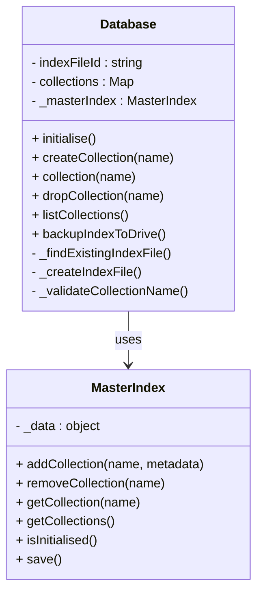

# GAS DB Implementation Plan

## 📊 Implementation Progress Summary

**Overall Status: 4 of 4 core sections completed, Sections 5-10 pending**

| Section | Status | Progress | Tests | Pass Rate | Notes |
|---------|--------|----------|-------|-----------|--------|
| **Section 1** | ✅ **COMPLETE** | 100% | 16/16 | 100% | Project setup, utilities, test framework |
| **Section 2** | ✅ **COMPLETE** | 100% | 16/16 | 100% | ScriptProperties master index, locking |
| **Section 3** | ✅ **COMPLETE** | 100% | 36/36 | 100% | File service, Drive API integration |
| **Section 4** | ✅ **COMPLETE** | 100% | 18/18 | 100% | Database/Collection (refactored) |
| **Sections 5-10** | ⏳ **PENDING** | 0% | - | - | Awaiting Section 4 completion |

**Total Tests Implemented:** 86 tests across 4 sections
**Tests Passing:** 86/86 (100% overall)
**Ready for Implementation:** Section 5 (Collection Components Implementation)

## Overview

This implementation plan outlines the development of the GAS DB MVP (Minimum Viable Product) using Test-Driven Development (TDD) principles. The plan divides the implementation into discrete, testable sections, each with specific objectives and test cases that must pass before progressing to the next section. So far, four core sections have been successfully completed.

The implementation will use Google Apps Script with clasp for testing, and assumes permissions to read and write to Google Drive files and folders. The plan focuses on delivering core functionality while ensuring code quality, maintainability, and adherence to the requirements specified in the PRD and Class Diagrams.

## ✅ Section 1: Project Setup and Basic Infrastructure (COMPLETED)

### Summary ✅

Section 1 successfully established the development environment, project structure, core utility classes, and the TDD framework. Key utilities like `GASDBLogger`, `ErrorHandler`, and `IdGenerator` were implemented and thoroughly tested. The test framework, including assertion utilities and a test runner, is fully operational.

**Key Achievements:**

- ✅ Clasp environment configured with an organized project structure.
- ✅ Comprehensive test framework (`AssertionUtilities.js`, `TestRunner.js`) implemented.
- ✅ Core utilities (`GASDBLogger.js`, `ErrorHandler.js`, `IdGenerator.js`) created and tested.
- ✅ `GASDBLogger` (renamed from `Logger`) provides robust, configurable logging.
- ✅ `test-runner.sh` script enhanced for reliable test execution with clasp.
- ✅ All 16 test cases for this section are passing (100%).

**Files Created:**

- Core: `GASDBLogger.js`, `ErrorHandler.js`, `IdGenerator.js`, `AssertionUtilities.js`, `TestRunner.js`
- Tests: `Section1Tests.js`, `TestExecution.js`
- Config: `package.json`, `appsscript.json`, `clasp.json`
- Automation: `test-runner.sh`
- Docs: `Section1_README.md`, `IMPLEMENTATION_PROGRESS.md`

This section provides the foundational tools and infrastructure for subsequent development.

## ✅ Section 2: ScriptProperties Master Index (COMPLETED)

### Summary ✅

Section 2 focused on implementing the `MasterIndex` class, which manages collection metadata and virtual locking using Google Apps Script's `ScriptProperties`. This component is crucial for efficient metadata access and preventing concurrent modification conflicts.

**Key Achievements:**

- ✅ `MasterIndex.js` (523 lines) implemented, providing methods for reading/writing to `ScriptProperties`, collection metadata management, virtual locking, and conflict detection/resolution.
- ✅ Integrated `ScriptLock` for robust locking.
- ✅ All 16 test cases covering index operations, locking, and conflict detection are passing (100%).

**Files Created:**

- Core: `MasterIndex.js`
- Tests: `Section2Tests.js`
- Updated: `TestExecution.js`, `test-runner.sh`

The `MasterIndex` provides a fast and reliable way to manage database metadata, minimizing direct Drive API calls for such operations.

## ✅ Section 3: File Service and Drive Integration (COMPLETED)

### Summary ✅

Section 3 successfully implemented the `FileService` and `FileOperations` classes, enabling robust interaction with Google Drive for storing and managing database files. Drive API integration is fully functional, and all related bugs have been resolved.

**Key Achievements:**

- ✅ `FileOperations.js` (501 lines) created for direct Drive API interactions (read, write, create, delete files) with logging and retry logic.
- ✅ `FileService.js` (223 lines) implemented as the primary interface for optimized file operations, including batching, caching, and circuit breaker patterns.
- ✅ Google Drive API access fully resolved and functional.
- ✅ All 36 test cases, covering basic file operations, advanced features (caching, circuit breaker), error handling, and integration, are passing (100%).
- ✅ Resolved issues including malformed JSON error handling and data structure preservation.

**Files Created:**

- Core: `FileOperations.js`, `FileService.js`
- Tests: `Section3Tests.js`
- Updated: `appsscript.json` (OAuth scopes), `TestExecution.js`

This section ensures reliable and optimized data persistence on Google Drive.

## ✅ Section 4: Database and Collection Management (COMPLETED & REFACTORED)

### Summary ✅

Section 4 implemented the core `Database` and `DatabaseConfig` classes. Initially, `Database` handled index file management and collection operations directly. A significant post-completion refactoring shifted primary responsibility for collection metadata and management to the `MasterIndex` (from Section 2), with the `Database` class now delegating these tasks. This optimizes performance by leveraging `ScriptProperties` and uses Drive-based index files mainly for backup and migration.

**Key Achievements & Architecture:**

- ✅ `DatabaseConfig.js` implemented for configuration validation and defaults.
- ✅ `Database.js` implemented for high-level database operations.
- ✅ **Post-Completion Refactoring**:
  - `MasterIndex` is now the authoritative source for collection metadata and IDs.
  - `Database` class methods (`collection()`, `createCollection()`, `listCollections()`, `dropCollection()`, `initialise()`) now delegate to `MasterIndex`.
  - Drive-based index files are used for explicit backup (`backupIndexToDrive()`) and recovery/migration.
  - This significantly reduces Drive API calls for routine operations.
- ✅ All 18 streamlined test cases (post-refactoring) covering `DatabaseConfig`, `Database` initialization, collection management delegation, index file structure (including corruption handling), and `MasterIndex` integration are passing (100%).

**Updated Design (Post-Refactoring):**

**Benefits of Refactoring:**

- ✅ Faster operations due to minimized Drive API calls.
- ✅ Clearer separation of concerns: `MasterIndex` for metadata, `Database` for high-level operations.
- ✅ Single source of truth for collection data (`MasterIndex`).
- ✅ Robust backup mechanism via Drive index file.

**Files Created/Updated:**

- Core: `DatabaseConfig.js`, `Database.js`
- Tests: `Section4Tests.js` (reflecting 18 tests post-refactoring)
- Updated: `UnifiedTestExecution.js`, `TestExecution.js`, `TestRunner.js`

This refactored architecture provides a more efficient and maintainable foundation for the database.

## Section 5: Collection Components Implementation

### Objectives

- Implement Collection class with separated components
- Create CollectionMetadata for metadata management
- Implement DocumentOperations for document manipulation

### Implementation Steps

1. **CollectionMetadata Implementation**
   - Create CollectionMetadata class
   - Implement metadata properties (created, lastUpdated, documentCount)
   - Implement metadata update methods

2. **DocumentOperations Implementation**
   - Create DocumentOperations class
   - Implement document manipulation methods
   - Prepare for integration with query and update engines

3. **Collection Integration**
   - Create Collection class to coordinate components
   - Implement public API methods that delegate to components
   - Implement lazy loading and memory management

### Test Cases

1. **CollectionMetadata Tests**
   - Test metadata initialization
   - Test metadata update methods
   - Test metadata persistence

2. **DocumentOperations Tests**
   - Test document manipulation methods
   - Test document ID generation
   - Test document validation

3. **Collection Integration Tests**
   - Test public API methods
   - Test component coordination
   - Test lazy loading behavior
   - Test memory management

### Completion Criteria

- All test cases pass
- CollectionMetadata properly manages collection statistics
- DocumentOperations handles document manipulation
- Collection coordinates components while providing a simple API

## Section 6: Basic CRUD Operations

### Objectives

- Implement document insertion
- Implement document retrieval
- Implement document update and deletion

### Implementation Steps

1. **Document Insertion**
   - Implement insertOne method in Collection
   - Delegate to DocumentOperations for document handling
   - Update CollectionMetadata after insertion

2. **Document Retrieval**
   - Implement findOne and find methods in Collection
   - Delegate to DocumentOperations for document retrieval
   - Implement countDocuments method

3. **Document Update and Deletion**
   - Implement updateOne method in Collection
   - Implement deleteOne method in Collection
   - Update CollectionMetadata after modifications

### Test Cases

1. **Insertion Tests**
   - Test document insertion
   - Test ID generation
   - Test duplicate ID handling
   - Test metadata updates after insertion

2. **Retrieval Tests**
   - Test findOne by ID
   - Test find with simple criteria
   - Test countDocuments
   - Test component coordination during retrieval

3. **Update and Deletion Tests**
   - Test document update
   - Test document deletion
   - Test metadata updates after modifications
   - Test component coordination during modifications

### Completion Criteria

- All test cases pass
- Documents can be inserted with proper IDs
- Documents can be retrieved by ID or simple criteria
- Documents can be updated and deleted
- Components coordinate properly during CRUD operations

## Section 7: Query Engine

### Objectives

- Implement basic query engine
- Support comparison operators
- Support logical operators

### Implementation Steps

1. **Query Engine Implementation**
   - Create QueryEngine class
   - Implement document matching
   - Integrate with DocumentOperations

2. **Comparison Operators**
   - Implement $eq operator
   - Implement $gt operator
   - Implement $lt operator

3. **Logical Operators**
   - Implement $and operator
   - Implement $or operator
   - Support nested conditions

### Test Cases

1. **Query Engine Tests**
   - Test basic document matching
   - Test field access
   - Test integration with DocumentOperations

2. **Comparison Operator Tests**
   - Test $eq with various types
   - Test $gt with numbers and dates
   - Test $lt with numbers and dates

3. **Logical Operator Tests**
   - Test $and with multiple conditions
   - Test $or with multiple conditions
   - Test nested logical operators

### Completion Criteria

- All test cases pass
- Query engine can match documents based on criteria
- Comparison operators work with various data types
- Logical operators support complex conditions
- QueryEngine integrates properly with DocumentOperations

## Section 8: Update Engine

### Objectives

- Implement basic update engine
- Support field modification operators
- Support field removal operators

### Implementation Steps

1. **Update Engine Implementation**
   - Create UpdateEngine class
   - Implement document modification
   - Integrate with DocumentOperations

2. **Field Modification**
   - Implement $set operator
   - Support nested field updates
   - Handle various data types

3. **Field Removal**
   - Implement $unset operator
   - Support nested field removal
   - Maintain document structure

### Test Cases

1. **Update Engine Tests**
   - Test basic document modification
   - Test field access
   - Test integration with DocumentOperations

2. **Field Modification Tests**
   - Test $set with various types
   - Test nested field updates
   - Test array and object updates

3. **Field Removal Tests**
   - Test $unset operator
   - Test nested field removal
   - Test document structure integrity

### Completion Criteria

- All test cases pass
- Update engine can modify documents based on operators
- Field modification works with various data types and structures
- Field removal maintains document integrity
- UpdateEngine integrates properly with DocumentOperations

## Section 9: Cross-Instance Coordination

### Objectives

- Implement cross-instance coordination
- Test concurrent operations
- Ensure data consistency

### Implementation Steps

1. **Coordination Implementation**
   - Integrate MasterIndex with Collection operations
   - Implement lock acquisition before modifications
   - Implement conflict detection during saves

2. **Concurrent Operation Handling**
   - Implement retry mechanism
   - Handle lock timeouts
   - Resolve conflicts

3. **Data Consistency**
   - Ensure atomic operations
   - Maintain collection metadata
   - Synchronize master index

### Test Cases

1. **Coordination Tests**
   - Test lock acquisition during operations
   - Test lock release after operations
   - Test modification token updates

2. **Concurrent Operation Tests**
   - Test simultaneous read operations
   - Test simultaneous write operations
   - Test read-during-write operations

3. **Data Consistency Tests**
   - Test operation atomicity
   - Test metadata consistency
   - Test recovery from failures

### Completion Criteria

- All test cases pass
- Cross-instance coordination prevents data corruption
- Concurrent operations are handled safely
- Data consistency is maintained across instances

## Section 10: Integration and System Testing

### Objectives

- Verify all components work together
- Test end-to-end workflows
- Validate against requirements

### Implementation Steps

1. **Component Integration**
   - Ensure all classes work together
   - Verify proper dependency injection
   - Test class relationships

2. **Workflow Testing**
   - Test complete database workflows
   - Test error handling and recovery
   - Test performance under load

3. **Requirements Validation**
   - Verify all PRD requirements are met
   - Validate against class diagrams
   - Ensure MongoDB compatibility

### Test Cases

1. **Integration Tests**
   - Test Database with Collection components
   - Test Collection with QueryEngine and UpdateEngine
   - Test FileService components with all other components

2. **Workflow Tests**
   - Test complete CRUD workflow
   - Test error handling and recovery
   - Test performance with various data sizes

3. **Validation Tests**
   - Test MongoDB syntax compatibility
   - Test against PRD requirements
   - Test against class diagrams

### Completion Criteria

- All test cases pass
- All components work together seamlessly
- Complete workflows function as expected
- All requirements from the PRD are met

## Test-Driven Development Process

For each section, the development process will follow these steps:

1. **Write Tests First**
   - Create test cases for the section's functionality
   - Ensure tests fail initially (red phase)

2. **Implement Functionality**
   - Write minimal code to make tests pass
   - Focus on functionality, not optimization

3. **Refactor Code**
   - Improve code quality while maintaining passing tests
   - Optimize for readability and performance

4. **Verify Completion Criteria**
   - Ensure all tests pass
   - Validate against section objectives
   - Document any issues or limitations

5. **Proceed to Next Section**
   - Only move to the next section when current section is complete
   - Maintain regression testing for previous sections

## Testing with Clasp

The implementation will use clasp for testing with Google Apps Script. Key considerations include:

1. **Test Environment**
   - Create isolated test environments in Drive
   - Clean up test data after tests
   - Use unique identifiers for test resources

2. **Test Runner**
   - Implement custom test runner for Apps Script
   - Support setup and teardown operations
   - Provide clear test reporting

3. **Mocking and Stubbing**
   - Mock Drive API for unit testing
   - Stub PropertiesService for controlled testing
   - Create test doubles for external dependencies
   - Mock component dependencies for isolated testing

4. **Permissions**
   - Tests will require Drive read/write permissions
   - Tests will require ScriptProperties access
   - Tests should run with the same permissions as the production code

---

## Implementation Considerations

1. **Google Apps Script Limitations**
   - 6-minute execution time limit
   - Synchronous execution model
   - Limited memory allocation
   - API quotas and rate limits

2. **Performance Optimization**
   - Minimize Drive API calls through FileOperations/FileCache separation
   - Optimize in-memory operations
   - Implement efficient data structures
   - Use dirty checking to reduce writes

3. **Error Handling**
   - Implement comprehensive error types
   - Provide clear error messages
   - Ensure proper cleanup after errors
   - Implement retry mechanisms where appropriate

4. **Documentation**
   - Document all classes and methods
   - Provide usage examples
   - Document limitations and constraints
   - Include performance considerations

## Conclusion

This implementation plan provides a structured approach to developing the GAS DB MVP using Test-Driven Development. By breaking the implementation into discrete, testable sections with clear objectives and completion criteria, the plan ensures that each component is thoroughly tested and meets requirements before integration. The first four core sections have been successfully completed, laying a strong foundation.

The focus on TDD ensures code quality and maintainability, while the section-by-section approach allows for incremental progress and validation. The plan addresses the unique challenges of Google Apps Script development, including execution limits, API constraints, and cross-instance coordination.

The separation of concerns in Collection and FileService components improves code maintainability and testability while remaining MVP-focused. This approach provides a solid foundation for future enhancements without overcomplicating the initial implementation.

## Implementation Status Summary

### ✅ COMPLETED SECTIONS

**Section 1: Project Setup and Basic Infrastructure** - COMPLETE

- Status: All objectives met, 16/16 tests passing (100%).
- Key Components: `GASDBLogger`, `ErrorHandler`, `IdGenerator`, Test Framework.
- Foundation for TDD and core utilities established.

**Section 2: ScriptProperties Master Index** - COMPLETE

- Status: All objectives met, 16/16 tests passing (100%).
- Key Components: `MasterIndex` class with virtual locking, conflict detection, `ScriptProperties` integration.
- Efficient metadata management and concurrency control established.

**Section 3: File Service and Drive Integration** - COMPLETE

- Status: All objectives met, 36/36 tests passing (100%).
- Key Components: `FileOperations`, `FileService`, Drive API integration.
- Robust and optimized file persistence on Google Drive achieved.

**Section 4: Database and Collection Management** - COMPLETE & REFACTORED

- Status: All objectives met (including refactoring), 18/18 tests passing (100%).
- Key Components: `DatabaseConfig`, `Database` (delegating to `MasterIndex`).
- Core database structure established with optimized metadata handling.

## Implementation Notes for Future Sections

### Section 1 Artifacts Available for Reuse

- **GASDBLogger**: Use `GASDBLogger.createComponentLogger(componentName)` for section-specific logging
- **ErrorHandler**: Extend with new error types as needed, use validation utilities
- **IdGenerator**: Use `IdGenerator.generateUUID()` for modification tokens
- **Test Framework**: Follow established pattern with TestSuite creation and GlobalTestRunner
