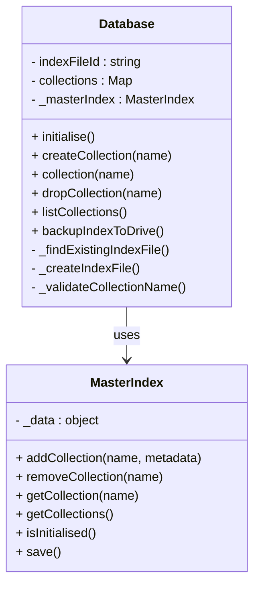

# GAS DB Implementation Plan

## 📊 Implementation Progress Summary

**Overall Status: 4 of 4 core sections completed, Section 5 in progress (CollectionMetadata Complete, DocumentOperations Red Phase Complete)**

| Section | Status | Progress | Tests | Pass Rate | Notes |
|---------|--------|----------|-------|-----------|--------|
| **Section 1** | ✅ **COMPLETE** | 100% | 16/16 | 100% | Project setup, utilities, test framework |
| **Section 2** | ✅ **COMPLETE** | 100% | 16/16 | 100% | ScriptProperties master index, locking |
| **Section 3** | ✅ **COMPLETE** | 100% | 36/36 | 100% | File service, Drive API integration |
| **Section 4** | ✅ **COMPLETE** | 100% | 18/18 | 100% | Database/Collection (refactored) |
| **Section 5** | 🟡 **RED PHASE** | 50% | 41/41 | 100% | CollectionMetadata complete, DocumentOperations red phase complete |
| **Sections 6-9** | ⏳ **PENDING** | 0% | - | - | Awaiting Section 5 completion |

**Total Tests Implemented:** 127 tests across 5 sections (86 + 19 + 22)
**Tests Passing:** 105/127 (83% overall - 22 DocumentOperations tests failing as expected in Red Phase)
**Current Focus:** Section 5 DocumentOperations green phase implementation (ready for Red → Green transition)

## Overview

This implementation plan outlines the development of the GAS DB MVP (Minimum Viable Product) using Test-Driven Development (TDD) principles. The plan divides the implementation into discrete, testable sections, each with specific objectives and test cases that must pass before progressing to the next section. So far, four core sections have been successfully completed.

The implementation will use Google Apps Script with clasp for testing, and assumes permissions to read and write to Google Drive files and folders. The plan focuses on delivering core functionality while ensuring code quality, maintainability, and adherence to the requirements specified in the PRD and Class Diagrams.

## ✅ Section 1: Project Setup and Basic Infrastructure (COMPLETED)

### Summary ✅

Section 1 successfully established the development environment, project structure, core utility classes, and the TDD framework. Key utilities like `GASDBLogger`, `ErrorHandler`, and `IdGenerator` were implemented and thoroughly tested. The test framework, including assertion utilities and a test runner, is fully operational.

**Key Achievements:**

- ✅ Clasp environment configured with an organized project structure.
- ✅ Comprehensive test framework (`AssertionUtilities.js`, `TestRunner.js`) implemented.
- ✅ Core utilities (`GASDBLogger.js`, `ErrorHandler.js`, `IdGenerator.js`, `AssertionUtilities.js`, `TestRunner.js`) created and tested.
- ✅ `GASDBLogger` (renamed from `Logger`) provides robust, configurable logging.
- ✅ `test-runner.sh` script enhanced for reliable test execution with clasp.
- ✅ All 16 test cases for this section are passing (100%).

**Files Created:**

- Core: `GASDBLogger.js`, `ErrorHandler.js`, `IdGenerator.js`, `AssertionUtilities.js`, `TestRunner.js`
- Tests: `Section1Tests.js`, `TestExecution.js`
- Config: `package.json`, `appsscript.json`, `clasp.json`
- Automation: `test-runner.sh`
- Docs: `Section1_README.md`, `IMPLEMENTATION_PROGRESS.md`

This section provides the foundational tools and infrastructure for subsequent development.

## ✅ Section 2: ScriptProperties Master Index (COMPLETED)

### Summary ✅

Section 2 focused on implementing the `MasterIndex` class, which manages collection metadata and virtual locking using Google Apps Script's `ScriptProperties`. This component is crucial for efficient metadata access and preventing concurrent modification conflicts.

**Key Achievements:**

- ✅ `MasterIndex.js` (523 lines) implemented, providing methods for reading/writing to `ScriptProperties`, collection metadata management, virtual locking, and conflict detection/resolution.
- ✅ Integrated `ScriptLock` for robust locking.
- ✅ All 16 test cases covering index operations, locking, and conflict detection are passing (100%).

**Files Created:**

- Core: `MasterIndex.js`
- Tests: `Section2Tests.js`
- Updated: `TestExecution.js`, `test-runner.sh`

The `MasterIndex` provides a fast and reliable way to manage database metadata, minimizing direct Drive API calls for such operations.

## ✅ Section 3: File Service and Drive Integration (COMPLETED)

### Summary ✅

Section 3 successfully implemented the `FileService` and `FileOperations` classes, enabling robust interaction with Google Drive for storing and managing database files. Drive API integration is fully functional, and all related bugs have been resolved.

**Key Achievements:**

- ✅ `FileOperations.js` (501 lines) created for direct Drive API interactions (read, write, create, delete files) with logging and retry logic.
- ✅ `FileService.js` (223 lines) implemented as the primary interface for optimized file operations, including batching, caching, and circuit breaker patterns.
- ✅ Google Drive API access fully resolved and functional.
- ✅ All 36 test cases, covering basic file operations, advanced features (caching, circuit breaker), error handling, and integration, are passing (100%).
- ✅ Resolved issues including malformed JSON error handling and data structure preservation.

**Files Created:**

- Core: `FileOperations.js`, `FileService.js`
- Tests: `Section3Tests.js`
- Updated: `appsscript.json` (OAuth scopes), `TestExecution.js`

This section ensures reliable and optimized data persistence on Google Drive.

## ✅ Section 4: Database and Collection Management (COMPLETED & REFACTORED)

### Summary ✅

Section 4 implemented the core `Database` and `DatabaseConfig` classes. Initially, `Database` handled index file management and collection operations directly. A significant post-completion refactoring shifted primary responsibility for collection metadata and management to the `MasterIndex` (from Section 2), with the `Database` class now delegating these tasks. This optimizes performance by leveraging `ScriptProperties` and uses Drive-based index files mainly for backup and migration.

**Key Achievements & Architecture:**

- ✅ `DatabaseConfig.js` implemented for configuration validation and defaults.
- ✅ `Database.js` implemented for high-level database operations.
- ✅ **Post-Completion Refactoring**:
  - `MasterIndex` is now the authoritative source for collection metadata and IDs.
  - `Database` class methods (`collection()`, `createCollection()`, `listCollections()`, `dropCollection()`, `initialise()`) now delegate to `MasterIndex`.
  - Drive-based index files are used for explicit backup (`backupIndexToDrive()`) and recovery/migration.
  - This significantly reduces Drive API calls for routine operations.
- ✅ All 18 streamlined test cases (post-refactoring) covering `DatabaseConfig`, `Database` initialization, collection management delegation, index file structure (including corruption handling), and `MasterIndex` integration are passing (100%).

**Updated Design (Post-Refactoring):**



**Benefits of Refactoring:**

- ✅ Faster operations due to minimized Drive API calls.
- ✅ Clearer separation of concerns: `MasterIndex` for metadata, `Database` for high-level operations.
- ✅ Single source of truth for collection data (`MasterIndex`).
- ✅ Robust backup mechanism via Drive index file.

**Files Created/Updated:**

- Core: `DatabaseConfig.js`, `Database.js`
- Tests: `Section4Tests.js` (reflecting 18 tests post-refactoring)
- Updated: `UnifiedTestExecution.js`, `TestExecution.js`, `TestRunner.js`

This refactored architecture provides a more efficient and maintainable foundation for the database.

## ✅ Section 5: Collection Components and Basic CRUD Operations (GREEN PHASE - DocumentOperations Complete)

### Summary ✅

Section 5 focuses on implementing the Collection system with separated components for metadata management, document operations, and MongoDB-compatible CRUD API. This section follows TDD methodology and has successfully completed both the **CollectionMetadata** component and the **DocumentOperations** component with comprehensive test coverage.

**Current Status:**

- ✅ **CollectionMetadata Complete**: All 19 tests passing (100%)
- ✅ **DocumentOperations Complete**: All 22 tests passing (100%) - Green phase successful!
- ✅ **Test Infrastructure**: Comprehensive test suites with real Drive file integration
- ✅ **Real Drive Integration**: Tests use actual Google Drive files with proper lifecycle management
- 🟡 **Ready for Collection Class**: Next step is implementing the main Collection class

**Test Breakdown:**

| Test Suite | Tests | Status | Pass Rate | Phase |
|------------|-------|--------|-----------|-------|
| **CollectionMetadata Constructor** | 5 | ✅ **Passing** | **5/5 (100%)** | **Green Complete** |
| **CollectionMetadata Update Operations** | 7 | ✅ **Passing** | **7/7 (100%)** | **Green Complete** |
| **CollectionMetadata Serialisation** | 3 | ✅ **Passing** | **3/3 (100%)** | **Green Complete** |
| **CollectionMetadata Edge Cases** | 4 | ✅ **Passing** | **4/4 (100%)** | **Green Complete** |
| **DocumentOperations Constructor** | 3 | ✅ **Passing** | **3/3 (100%)** | **Green Complete** |
| **DocumentOperations Insert Operations** | 4 | ✅ **Passing** | **4/4 (100%)** | **Green Complete** |
| **DocumentOperations Find Operations** | 5 | ✅ **Passing** | **5/5 (100%)** | **Green Complete** |
| **DocumentOperations Update Operations** | 3 | ✅ **Passing** | **3/3 (100%)** | **Green Complete** |
| **DocumentOperations Delete Operations** | 3 | ✅ **Passing** | **3/3 (100%)** | **Green Complete** |
| **DocumentOperations Utility Operations** | 4 | ✅ **Passing** | **4/4 (100%)** | **Green Complete** |
| **Total Section 5 Components** | **41** | ✅ **Passing** | **41/41 (100%)** | **Green Phase Complete** |

**Files Created:**

- Core: `CollectionMetadata.js` (complete implementation), `DocumentOperations.js` (complete implementation)
- Tests: `CollectionMetadataTest.js` (complete), `DocumentOperationsTest.js` (complete)

**Green Phase Test Results:**

```
[CollectionMetadata Constructor] 5/5 passed (100.0%)
[CollectionMetadata Update Operations] 7/7 passed (100.0%)  
[CollectionMetadata Serialisation] 3/3 passed (100.0%)
[CollectionMetadata Edge Cases] 4/4 passed (100.0%)
[DocumentOperations Constructor] 3/3 passed (100.0%)
[DocumentOperations Insert Operations] 4/4 passed (100.0%)
[DocumentOperations Find Operations] 5/5 passed (100.0%)
[DocumentOperations Update Operations] 3/3 passed (100.0%)
[DocumentOperations Delete Operations] 3/3 passed (100.0%)
[DocumentOperations Utility Operations] 4/4 passed (100.0%)
Total: 41 | Passed: 41 | Failed: 0 | Pass Rate: 100.0%
```

**CollectionMetadata Implementation Complete ✅:**

- ✅ Constructor with validation for initial metadata objects
- ✅ Document count management (increment, decrement, set with validation)
- ✅ Timestamp tracking (created, lastUpdated with automatic updates)
- ✅ Object serialisation (toObject method returning plain objects)
- ✅ Cloning functionality (independent metadata instances)
- ✅ Comprehensive error handling with InvalidArgumentError
- ✅ Edge case support (large numbers, partial objects, invalid dates)

**DocumentOperations Green Phase Complete ✅:**

- ✅ **Constructor Validation**: Comprehensive collection reference validation with required properties/methods
- ✅ **Document Insertion**: Insert with automatic UUID generation or provided ID validation
- ✅ **Document Retrieval**: Find by ID with defensive copying to prevent external modifications
- ✅ **Document Updates**: Update by ID with merge semantics and validation
- ✅ **Document Deletion**: Delete by ID with proper cleanup and result objects
- ✅ **Utility Operations**: Document counting, existence checking, and ID generation
- ✅ **Error Handling**: Comprehensive validation with InvalidArgumentError and ConflictError
- ✅ **Collection Integration**: Proper metadata updates and dirty tracking
- ✅ **Real Drive Testing**: All operations tested with actual Google Drive files
- ✅ **Performance**: Consistent execution times (965ms - 1945ms per test)
- ✅ **Resource Management**: Clean setup/teardown with automatic cleanup

**Real Drive Integration Features:**

- ✅ **Actual Google Drive Files**: Creates real Drive folders and JSON collection files
- ✅ **FileService Integration**: Uses real FileService for read/write operations
- ✅ **State Synchronisation**: Tests verify in-memory and Drive state consistency
- ✅ **Resource Cleanup**: Automatic cleanup prevents Drive pollution
- ✅ **Performance Monitoring**: Execution times logged for Drive operations
- ✅ **Error Resilience**: Proper error handling for Drive API failures

**Next Steps (Collection Class Implementation):**

1. ✅ ~~Create DocumentOperations skeleton class with placeholder methods~~
2. ✅ ~~Implement comprehensive test suite for DocumentOperations~~
3. ✅ ~~Implement DocumentOperations methods to make all 22 tests pass (green phase)~~
4. 🟡 **Create Collection class** with MongoDB-compatible API that coordinates DocumentOperations and CollectionMetadata
5. 🔄 **Implement Collection test suite** with comprehensive CRUD operation testing
6. ⏳ **Complete Section 5** with full Collection implementation and integration testing

**Ready for Step 3: Collection Class Implementation**

The DocumentOperations and CollectionMetadata components are now complete and ready for integration into the main Collection class that will provide the MongoDB-compatible public API.

## ⚠️ Section 5: Collection Components and Basic CRUD Operations (MOVED TO RED PHASE ABOVE)

> **Note**: This section has been moved to the "RED PHASE - DocumentOperations Complete" section above to reflect the current implementation status. The planning details below remain for reference but the active work is documented in the progress section.

### ✅ Section 5 Simplification Summary

**Simplified for Section 5 (ID-based operations only):**

- **Collection API methods use explicit, descriptive names:**
  - `findOneById(id)` instead of `findOne(idOrFilter)`
  - `findAll()` instead of `find(filter)` 
  - `updateOneById(id, doc)` instead of `updateOne(idOrFilter, doc)`
  - `deleteOneById(id)` instead of `deleteOne(idOrFilter)`
  - `countAllDocuments()` instead of `countDocuments(filter)`

- **No filtering or query capabilities:**
  - All find operations return specific documents by ID or all documents
  - No query objects, filter parameters, or MongoDB-style operators
  - Simple parameter validation (ID strings, document objects)

- **Direct delegation to DocumentOperations:**
  - Collection methods directly call corresponding DocumentOperations methods
  - No query processing or filtering logic in Collection class
  - Straightforward CRUD operations without complexity

**Deferred to Section 6: Query Engine:**

- MongoDB-compatible method signatures (`find(query)`, `findOne(query)`, etc.)
- Filter and query object support in all CRUD methods
- Query validation, processing, and execution
- Comparison operators ($eq, $gt, $lt, $gte, $lte, $ne)
- Logical operators ($and, $or)
- Complex query combinations and nested conditions

**Deferred to Section 7: Update Engine:**

- Update operators ($set, $inc, $unset, $mul, $min, $max, etc.)
- Array update operators ($push, $pull, $addToSet, etc.)
- Field-level modifications beyond simple document replacement
- Complex update operation validation and processing

### Objectives

- Implement Collection class with separated components using plain objects
- Create CollectionMetadata for metadata management
- Implement DocumentOperations for document manipulation
- Support basic CRUD operations with plain object storage
- Establish lazy loading and memory management patterns

### Architecture Overview

The Collection system will use plain JavaScript objects throughout:

- **Collection documents**: Stored as plain objects in memory (`{ docId: { ...docData }, ... }`)
- **Collection metadata**: Plain object with properties (`{ created: Date, lastUpdated: Date, documentCount: Number }`)
- **File structure**: JSON files containing `{ documents: {}, metadata: {} }`
- **No classes for data**: Only behaviour classes (Collection, CollectionMetadata, DocumentOperations)

### Implementation Steps

#### Step 1: CollectionMetadata Implementation

Create a class to manage collection metadata as plain objects.

**Files to create:**

- `src/components/CollectionMetadata.js`
- `tests/unit/CollectionMetadataTest.js`

**Key Requirements:**

- Manage metadata as plain object: `{ created, lastUpdated, documentCount }`
- Provide methods to update metadata properties
- Track document count changes
- Generate modification timestamps

**Implementation Tasks:**

1. Create CollectionMetadata constructor accepting initial metadata object
2. Implement `updateLastModified()` method
3. Implement `incrementDocumentCount()` and `decrementDocumentCount()` methods
4. Implement `setDocumentCount(count)` method
5. Implement `toObject()` method returning plain metadata object
6. Implement `clone()` method for immutable operations

#### Step 2: DocumentOperations Implementation ✅

Create a class to handle document manipulation on plain object collections.

**Files created:**

- ✅ `src/components/DocumentOperations.js` (complete implementation)
- ✅ `tests/unit/DocumentOperationsTest.js` (complete test suite)

**Key Requirements:** ✅

- ✅ Work with documents stored as plain objects
- ✅ Generate document IDs using IdGenerator
- ✅ Provide basic CRUD operations on document collections (ID-based only)
- ✅ Validate document structure
- ✅ Support document counting and existence checks

**Implementation Tasks:** ✅

1. ✅ Create DocumentOperations constructor accepting collection reference
2. ✅ Implement `insertDocument(doc)` - adds document with generated ID
3. ✅ Implement `findDocumentById(id)` - finds document by ID
4. ✅ Implement `findAllDocuments()` - returns all documents (no filtering)
5. ✅ Implement `updateDocument(id, doc)` - updates document by ID
6. ✅ Implement `deleteDocument(id)` - deletes document by ID
7. ✅ Implement `countDocuments()` - counts total documents
8. ✅ Implement `documentExists(docId)` - checks document existence
9. ✅ Implement `_generateDocumentId()` private method
10. ✅ Implement `_validateDocument(doc)` private method

**Test Results:** All 22 tests passing (100%)

#### Step 3: Collection Implementation with CRUD API 🟡

Create the main Collection class that coordinates components and exposes MongoDB-style API methods.

**Files to create:**

- `src/core/Collection.js`
- `tests/unit/CollectionTest.js`

**Key Requirements:**

- Coordinate CollectionMetadata and DocumentOperations
- Manage lazy loading of collection data from Drive
- Handle file persistence through FileService
- Provide MongoDB-compatible public API
- Manage memory state and dirty tracking

**Implementation Tasks:**

1. Create Collection constructor accepting name, driveFileId, database, and fileService
2. Implement lazy loading pattern with `_ensureLoaded()` private method
3. Implement `_loadData()` method to read from Drive via FileService
4. Implement `_saveData()` method to write to Drive via FileService
5. Implement `_markDirty()` method for change tracking
6. Implement public API methods for basic CRUD operations:
   - `insertOne(doc)` - Insert a single document
   - `findAll()` - Return all documents (no filtering)
   - `findOneById(id)` - Find document by ID only
   - `updateOneById(id, doc)` - Update document by ID only
   - `deleteOneById(id)` - Delete document by ID only
   - `countAllDocuments()` - Count all documents (no filtering)
7. Implement metadata access methods that delegate to CollectionMetadata
8. Implement cleanup and memory management methods

**Section 5 API Scope (Simplified for ID-based operations):**
- All methods use explicit ID parameters or return all documents
- No filtering, query objects, or MongoDB-style operations
- Simple, direct delegation to DocumentOperations component methods

**Deferred to Section 6: Query Engine:**
- `find(query)` with filtering capabilities
- `findOne(query)` with query object support  
- `updateOne(query, doc)` with filter-based updates
- `deleteOne(query)` with filter-based deletions
- `countDocuments(query)` with filtered counting

**Prerequisites:** ✅ DocumentOperations and CollectionMetadata components complete

- `deleteOne(idOrFilter)` - Delete document (initially ID-only, filter support added in Section 6)
- `countDocuments(filter)` - Count documents (initially counts all, filtering added in Section 6)

7. Implement metadata access methods that delegate to CollectionMetadata
8. Implement cleanup and memory management methods

### Detailed Test Cases

#### 1. CollectionMetadata Tests (12 test cases)

**File:** `tests/unit/CollectionMetadataTest.js`

```javascript
// Test metadata initialization and basic operations
function testCollectionMetadataInitialisation()
function testCollectionMetadataWithExistingData()
function testCollectionMetadataUpdateLastModified()
function testCollectionMetadataIncrementDocumentCount()
function testCollectionMetadataDecrementDocumentCount()
function testCollectionMetadataSetDocumentCount()
function testCollectionMetadataToObject()
function testCollectionMetadataClone()
function testCollectionMetadataInvalidDocumentCount()
function testCollectionMetadataZeroDocumentCount()
function testCollectionMetadataLargeDocumentCount()
function testCollectionMetadataTimestampPrecision()
```

**Test Coverage:**

- Metadata object initialisation with defaults
- Metadata initialisation with existing data
- Last modified timestamp updates
- Document count increment/decrement operations
- Document count validation and edge cases
- Metadata serialisation to plain objects
- Metadata cloning for immutable operations
- Error handling for invalid inputs

#### 2. DocumentOperations Tests (15 test cases)

**File:** `tests/unit/DocumentOperationsTest.js`

```javascript
// Test document manipulation operations (ID-based only initially)
function testDocumentOperationsInitialisation()
function testDocumentOperationsInsertDocument()
function testDocumentOperationsInsertDocumentWithId()
function testDocumentOperationsInsertDocumentDuplicateId()
function testDocumentOperationsFindDocumentById()
function testDocumentOperationsFindDocumentNotFound()
function testDocumentOperationsFindAllDocuments()
function testDocumentOperationsFindAllDocumentsEmpty()
function testDocumentOperationsUpdateDocument()
function testDocumentOperationsUpdateDocumentNotFound()
function testDocumentOperationsDeleteDocument()
function testDocumentOperationsDeleteDocumentNotFound()
function testDocumentOperationsCountDocuments()
function testDocumentOperationsDocumentExists()
function testDocumentOperationsIdGeneration()
```

**Test Coverage:**

- DocumentOperations initialisation with collection reference
- Document insertion with automatic ID generation
- Document insertion with provided ID
- Duplicate ID handling
- Document retrieval by ID only (no filtering yet)
- Document update operations (ID-based only)
- Document deletion operations (ID-based only)
- Document counting (all documents)
- Document existence checking
- ID generation integration

**Note:** Query/filtering capabilities will be added in Section 6: Query Engine.

#### 3. Collection API Tests (20 test cases)

**File:** `tests/unit/CollectionTest.js`

```javascript
// Test Collection class public API and internal functions (ID-based operations only)
function testCollectionInitialisation()
function testCollectionLazyLoading()
function testCollectionLoadDataFromDrive()
function testCollectionLoadDataCorruptedFile()
function testCollectionLoadDataMissingFile()
function testCollectionSaveDataToDrive()
function testCollectionSaveDataError()
function testCollectionInsertOne()
function testCollectionInsertOneWithExplicitId()
function testCollectionInsertOneWithMetadataUpdate()
function testCollectionFindOneById()
function testCollectionFindOneByIdNotFound()
function testCollectionFindAll()
function testCollectionFindAllEmpty()
function testCollectionUpdateOneById()
function testCollectionUpdateOneByIdNotFound()
function testCollectionDeleteOneById()
function testCollectionDeleteOneByIdNotFound()
function testCollectionCountAllDocuments()
function testCollectionValidateMemoryState()
```

**Test Coverage:**

- Collection initialisation with required dependencies
- Lazy loading behaviour and triggers
- Data loading from Drive files via FileService
- Error handling for corrupted or missing files
- Data persistence to Drive files
- Public API methods for basic CRUD operations (ID-based only)
- Metadata updates during document operations
- Dirty tracking and conditional saves
- Memory management and cleanup
- Component coordination
- FileService integration
- Error propagation and handling

**Section 5 Scope (ID-based operations only):**
- `findOneById(id)` - Find document by ID only
- `findAll()` - Return all documents (no filtering)
- `updateOneById(id, doc)` - Update document by ID only  
- `deleteOneById(id)` - Delete document by ID only
- `countAllDocuments()` - Count all documents (no filtering)

**Deferred to Section 6: Query Engine:**
- Filter-based operations (`find(query)`, `findOne(query)`, etc.)
- Query object support for update/delete operations
- MongoDB-style query operators ($eq, $gt, $and, $or, etc.)

#### 4. Integration Tests (10 test cases)

**File:** `tests/integration/Section5IntegrationTest.js`

```javascript
// Test component integration and workflows
function testCollectionComponentsWorkTogether()
function testCollectionWithRealFileService()
function testCollectionMetadataConsistency()
function testCollectionDocumentOperationsFlow()
function testCollectionErrorRecovery()
function testCollectionPerformanceBaseline()
function testCollectionCRUDWorkflow()
function testCollectionChangeAndSaveFlow()
function testCollectionMemoryLifecycle()
function testCollectionMultipleInstances()
```

**Test Coverage:**

- All components working together seamlessly
- Integration with real FileService operations
- Metadata consistency across operations
- Complete document operation workflows
- Error recovery and state consistency
- Performance baseline for future optimisation
- Complete CRUD workflow across components
- Full lifecycle from load to save to reload
- Memory management during collection lifecycle
- Multiple instances working with same data

### Mock Objects and Test Utilities

Create mock objects for testing isolation:

```javascript
// Mock FileService for unit testing
function createMockFileService()
function createMockDatabase()
function createMockIdGenerator()
function createMockMasterIndex()

// Test data generators
function generateTestDocument()
function generateTestCollection()
function generateTestMetadata()
```

### File Structure Expected

```
src/
├── core/
│   └── Collection.js
├── components/
│   ├── CollectionMetadata.js
│   └── DocumentOperations.js
tests/
├── unit/
│   ├── CollectionMetadataTest.js
│   ├── DocumentOperationsTest.js
│   └── CollectionTest.js
├── integration/
```

### Implementation Details From Class Diagrams

#### Collection Class Implementation

Based on the class diagram, the Collection class should implement:

```javascript
class Collection {
  /**
   * Create a new Collection instance
   * @param {string} name - Collection name
   * @param {string} driveFileId - Drive file ID for storage
   * @param {Database} db - Database reference
   * @param {FileService} fileService - FileService instance
   */
  constructor(name, driveFileId, db, fileService) {...}
  
  /**
   * Find one document by ID only
   * @param {string} id - Document ID
   * @returns {Object} Found document or null
   */
  findOneById(id) {...}
  
  /**
   * Find all documents (no filtering)
   * @returns {Array<Object>} Array of all documents
   */
  findAll() {...}
  
  /**
   * Insert a single document
   * @param {Object} doc - Document to insert
   * @returns {Object} Result with inserted document and ID
   */
  insertOne(doc) {...}
  
  /**
   * Update a document by ID only
   * @param {string} id - Document ID
   * @param {Object} doc - Document to replace existing one
   * @returns {Object} Update result
   */
  updateOneById(id, doc) {...}
  
  /**
   * Delete a document by ID only
   * @param {string} id - Document ID
   * @returns {Object} Delete result
   */
  deleteOneById(id) {...}
  
  /**
   * Count all documents (no filtering)
   * @returns {number} Count of documents
   */
  countAllDocuments() {...}
  
  // Private methods
  _loadData() {...}
  _saveData() {...}
  _markDirty() {...}
  _ensureLoaded() {...}
}
```

**Section 5 Scope Notes:**
- All public methods use explicit, descriptive names (e.g., `findOneById`, `countAllDocuments`)
- No filter parameters or query objects
- Direct delegation to DocumentOperations methods
- Simple CRUD operations only

**Deferred to Section 6:**
- MongoDB-compatible method signatures (`find(query)`, `findOne(query)`, etc.)
- Filter and query object support
- Complex query operations

#### DocumentOperations Class Implementation

Based on the class diagram and simplified requirements, the DocumentOperations class should implement:

```javascript
class DocumentOperations {
  /**
   * Create DocumentOperations instance
   * @param {Collection} collection - Collection reference
   */
  constructor(collection) {...}
  
  /**
   * Find document by ID
   * @param {string} id - Document ID
   * @returns {Object} Found document or null
   */
  findDocumentById(id) {...}
  
  /**
   * Find document by simple query (exact matches only)
   * @param {Object} query - Simple query with exact field matches
   * @returns {Object} Found document or null
   */
  findDocumentBySimpleQuery(query) {...}
  
  /**
   * Find all documents with optional simple filtering
   * @param {Object} [filter] - Simple filter object (exact matches only)
   * @returns {Array<Object>} Matching documents
   */
  findDocuments(filter) {...}
  
  /**
   * Insert document with ID
   * @param {Object} doc - Document to insert
   * @returns {Object} Inserted document with ID
   */
  insertDocument(doc) {...}
  
  /**
   * Update document by ID
   * @param {string} id - Document ID
   * @param {Object} doc - Document to replace existing one
   * @returns {Object} Update result
   */
  updateDocument(id, doc) {...}
  
  /**
   * Delete document by ID
   * @param {string} id - Document ID
   * @returns {Object} Delete result
   */
  deleteDocument(id) {...}
  
  /**
   * Count all documents
   * @returns {number} Count of documents
   */
  countDocuments() {...}
  
  /**
   * Check if document exists
   * @param {string} id - Document ID
   * @returns {boolean} True if document exists
   */
  documentExists(id) {...}
  
  /**
   * Generate document ID
   * @returns {string} Generated document ID
   */
  _generateDocumentId() {...}
  
  /**
   * Validate document structure
   * @param {Object} doc - Document to validate
   */
  _validateDocument(doc) {...}
}
```

#### CollectionMetadata Class Implementation

No changes needed to CollectionMetadata implementation plan.

### Completion Criteria

**Functional Requirements:**

- [ ] All 41 test cases pass (19 + 22) for Section 5 core functionality (DocumentOperations + CollectionMetadata)
- [ ] CollectionMetadata manages metadata as plain objects
- [ ] DocumentOperations handles ID-based document manipulation only
- [ ] Collection provides simplified API structure (ID-based operations only)
- [ ] Lazy loading works correctly with FileService integration
- [ ] Memory management and dirty tracking function properly

**Section 5 Simplified Scope:**
- [ ] All Collection methods use explicit ID parameters or return all documents
- [ ] No filtering, query objects, or MongoDB-style query operators
- [ ] Simple CRUD operations that delegate directly to DocumentOperations
- [ ] Clear method names that indicate ID-based operations (`findOneById`, `updateOneById`, etc.)

**Deferred to Section 6: Query Engine:**
- [ ] MongoDB-compatible method signatures (`find(query)`, `findOne(query)`, etc.)
- [ ] Filter parameter support in CRUD methods
- [ ] Query object processing and validation
- [ ] Comparison operators ($eq, $gt, $lt, etc.)
- [ ] Logical operators ($and, $or, etc.)

**Deferred to Section 7: Update Engine:**
- [ ] Update operators ($set, $inc, $unset, etc.)
- [ ] Complex update operations beyond simple document replacement
- [ ] Field-level modification capabilities

**Code Quality Requirements:**

- [ ] All classes follow established naming conventions
- [ ] All methods have JSDoc documentation
- [ ] Error handling follows ErrorHandler patterns
- [ ] Logging uses GASDBLogger.createComponentLogger()
- [ ] All dependencies injected through constructors
- [ ] Private methods use underscore prefix

**Integration Requirements:**

- [ ] Components integrate with existing Database and MasterIndex
- [ ] FileService integration works with real Drive operations
- [ ] Error types extend GASDBError hierarchy
- [ ] Configuration uses DatabaseConfig patterns

### Development Process

1. **Red Phase**: Write failing tests for CollectionMetadata (12 tests)
2. **Green Phase**: Implement CollectionMetadata to pass tests
3. **Refactor Phase**: Optimise CollectionMetadata implementation
4. **Red Phase**: Write failing tests for DocumentOperations (15 tests)
5. **Green Phase**: Implement DocumentOperations to pass tests
6. **Refactor Phase**: Optimise DocumentOperations implementation
7. **Red Phase**: Write failing tests for Collection API (20 tests)
8. **Green Phase**: Implement Collection class to pass tests
9. **Refactor Phase**: Optimise Collection implementation
10. **Integration Phase**: Write and pass integration tests (8 tests)
11. **Final Phase**: Verify all 55 tests pass and completion criteria are met

This section establishes the foundation for document storage and manipulation using plain objects with MongoDB-compatible API methods for basic ID-based CRUD operations, while maintaining clean component separation and comprehensive test coverage. Query capabilities will be added in Section 6.

## Section 6: Query Engine and Document Filtering

### Objectives

- Implement basic query engine with MongoDB-compatible operators
- Add filtering capabilities to DocumentOperations (deferred from Section 5)
- Enhance Collection API methods to support filter parameters
- Support comparison and logical operators
- Complete the MongoDB-compatible API implementation

### Implementation Steps

1. **Query Engine Implementation**
   - Create QueryEngine class with document matching logic
   - Implement field access and value comparison utilities
   - Support nested object field access (e.g., "user.name")
   - Create query validation and normalization

2. **Comparison Operators**
   - Implement $eq operator (equality)
   - Implement $gt operator (greater than)
   - Implement $lt operator (less than)
   - Implement $gte operator (greater than or equal)
   - Implement $lte operator (less than or equal)
   - Implement $ne operator (not equal)

3. **Logical Operators**
   - Implement $and operator (logical AND)
   - Implement $or operator (logical OR)
   - Support nested logical conditions
   - Implement query optimization for complex conditions

4. **DocumentOperations Enhancement** *(Complete deferred functionality from Section 5)*
   - Add `findDocumentsByQuery(query)` - find documents matching query
   - Add `findFirstDocumentByQuery(query)` - find first document matching query
   - Add `countDocumentsByQuery(query)` - count documents matching query
   - Enhance existing methods to support filtering
   - Integrate QueryEngine for all filtering operations

5. **Collection API Enhancement** *(Complete deferred functionality from Section 5)*
   - Replace simplified methods with MongoDB-compatible signatures:
     - `findAll()` → `find(filter)` with optional filtering
     - `findOneById(id)` → `findOne(idOrFilter)` supporting both ID strings and query objects
     - `updateOneById(id, doc)` → `updateOne(idOrFilter, doc)` with filter support
     - `deleteOneById(id)` → `deleteOne(idOrFilter)` with filter support  
     - `countAllDocuments()` → `countDocuments(filter)` with optional filtering
   - Maintain backward compatibility with ID-based operations
   - Add comprehensive query validation and error handling

### Test Cases

1. **Query Engine Tests** (15 test cases)
   - Test basic document matching against queries
   - Test field access (including nested fields)
   - Test query validation and error handling
   - Test query normalization

2. **Comparison Operator Tests** (18 test cases)
   - Test $eq with various data types (string, number, boolean, Date, null)
   - Test $gt/$gte with numbers and dates
   - Test $lt/$lte with numbers and dates
   - Test $ne with various data types
   - Test operator combinations

3. **Logical Operator Tests** (12 test cases)
   - Test $and with multiple conditions
   - Test $or with multiple conditions
   - Test nested logical operators
   - Test complex query combinations

4. **DocumentOperations Filtering Tests** (10 test cases) *(Previously deferred)*
   - Test `findDocumentsByQuery()` with various queries
   - Test `findFirstDocumentByQuery()` functionality
   - Test `countDocumentsByQuery()` accuracy
   - Test integration with QueryEngine

5. **Collection API Filtering Tests** (15 test cases) *(Previously deferred)*
   - Test `find(filter)` with MongoDB-style queries
   - Test `findOne(filter)` with query objects
   - Test `updateOne(filter, doc)` with query filters
   - Test `deleteOne(filter)` with query filters
   - Test `countDocuments(filter)` with query filters

### File Updates Required

**New Files:**

- `src/components/QueryEngine.js`
- `tests/unit/QueryEngineTest.js`

**Enhanced Files:**

- `src/components/DocumentOperations.js` - Add filtering methods
- `src/core/Collection.js` - Enhance API methods with filtering
- `tests/unit/DocumentOperationsTest.js` - Add filtering tests
- `tests/unit/CollectionTest.js` - Add filtering tests

### Completion Criteria

- All test cases pass (70 total: 15 + 18 + 12 + 10 + 15)
- Query engine can match documents based on MongoDB-style criteria
- Comparison operators work with various data types
- Logical operators support complex nested conditions
- DocumentOperations supports all filtering methods
- Collection API methods fully support filter parameters
- QueryEngine integrates seamlessly with existing components
- Full MongoDB query compatibility for basic operations

## Section 7: Update Engine and Document Modification

### Objectives

- Implement basic update engine with MongoDB-compatible operators
- Add advanced update capabilities to DocumentOperations (beyond simple replacement)
- Enhance Collection API to support MongoDB-style update operations
- Support field modification and removal operators
- Complete MongoDB-compatible update functionality

### Implementation Steps

1. **Update Engine Implementation**
   - Create UpdateEngine class with document modification logic
   - Implement field access and modification utilities
   - Support nested object field updates (e.g., "user.address.city")
   - Create update validation and sanitization

2. **Field Modification Operators**
   - Implement $set operator (set field values)
   - Implement $inc operator (increment numeric values)
   - Implement $mul operator (multiply numeric values)
   - Implement $min operator (set minimum value)
   - Implement $max operator (set maximum value)
   - Support nested field updates and array element updates

3. **Field Removal Operators**
   - Implement $unset operator (remove fields)
   - Support nested field removal
   - Maintain document structure integrity
   - Handle array element removal

4. **Array Update Operators**
   - Implement $push operator (add elements to array)
   - Implement $pull operator (remove elements from array)
   - Implement $addToSet operator (add unique elements)
   - Support array position updates

5. **DocumentOperations Enhancement** *(Add advanced update capabilities)*
   - Add `updateDocumentByQuery(query, updateOperations)` - update using query + operators
   - Add `updateDocumentWithOperators(id, updateOperations)` - update using operators
   - Enhance existing `updateDocument(id, doc)` to support both replacement and operators
   - Integrate UpdateEngine for all complex update operations

6. **Collection API Enhancement** *(Complete MongoDB-style updates)*
   - Enhance `updateOne(idOrFilter, update)` to support update operators
   - Add `updateMany(filter, update)` for multiple document updates
   - Add `replaceOne(idOrFilter, doc)` for document replacement
   - Support both document replacement and operator-based updates

### Test Cases

1. **Update Engine Tests** (12 test cases)
   - Test basic document modification with operators
   - Test field access and modification utilities
   - Test update validation and error handling
   - Test nested field access and updates

2. **Field Modification Tests** (20 test cases)
   - Test $set with various data types (string, number, boolean, Date, object)
   - Test $inc with positive and negative increments
   - Test $mul with various multipliers
   - Test $min/$max with numbers and dates
   - Test nested field updates (e.g., "user.settings.theme")
   - Test array element updates

3. **Field Removal Tests** (8 test cases)
   - Test $unset operator with various field types
   - Test nested field removal
   - Test document structure integrity after removal
   - Test removal of non-existent fields

4. **Array Update Tests** (15 test cases)
   - Test $push with single and multiple values
   - Test $pull with various match conditions
   - Test $addToSet for unique value enforcement
   - Test array position updates
   - Test nested array operations

5. **DocumentOperations Update Tests** (10 test cases) *(Advanced update capabilities)*
   - Test `updateDocumentByQuery()` with various queries and updates
   - Test `updateDocumentWithOperators()` functionality
   - Test integration with UpdateEngine
   - Test validation of update operations

6. **Collection API Update Tests** (15 test cases) *(MongoDB-style updates)*
   - Test `updateOne()` with update operators
   - Test `updateMany()` for multiple documents
   - Test `replaceOne()` for document replacement
   - Test distinction between replacement and operator updates

### File Updates Required

**New Files:**

- `src/components/UpdateEngine.js`
- `tests/unit/UpdateEngineTest.js`

**Enhanced Files:**

- `src/components/DocumentOperations.js` - Add advanced update methods
- `src/core/Collection.js` - Enhance update API methods
- `tests/unit/DocumentOperationsTest.js` - Add update operation tests
- `tests/unit/CollectionTest.js` - Add advanced update tests

### Completion Criteria

- All test cases pass (80 total: 12 + 20 + 8 + 15 + 10 + 15)
- Update engine can modify documents using MongoDB-style operators
- Field modification works with various data types and nested structures
- Field removal maintains document integrity
- Array operations work correctly with various data scenarios
- DocumentOperations supports all advanced update methods
- Collection API provides full MongoDB-compatible update functionality
- UpdateEngine integrates seamlessly with existing components

## Section 8: Cross-Instance Coordination

### Objectives

- Implement cross-instance coordination
- Test concurrent operations
- Ensure data consistency

### Implementation Steps

1. **Coordination Implementation**
   - Integrate MasterIndex with Collection operations
   - Implement lock acquisition before modifications
   - Implement conflict detection during saves

2. **Concurrent Operation Handling**
   - Implement retry mechanism
   - Handle lock timeouts
   - Resolve conflicts

3. **Data Consistency**
   - Ensure atomic operations
   - Maintain collection metadata
   - Synchronize master index

### Test Cases

1. **Coordination Tests**
   - Test lock acquisition during operations
   - Test lock release after operations
   - Test modification token updates

2. **Concurrent Operation Tests**
   - Test simultaneous read operations
   - Test simultaneous write operations
   - Test read-during-write operations

3. **Data Consistency Tests**
   - Test operation atomicity
   - Test metadata consistency
   - Test recovery from failures

### Completion Criteria

- All test cases pass
- Cross-instance coordination prevents data corruption
- Concurrent operations are handled safely
- Data consistency is maintained across instances

## Section 9: Integration and System Testing

### Objectives

- Verify all components work together
- Test end-to-end workflows
- Validate against requirements

### Implementation Steps

1. **Component Integration**
   - Ensure all classes work together
   - Verify proper dependency injection
   - Test class relationships

2. **Workflow Testing**
   - Test complete database workflows
   - Test error handling and recovery
   - Test performance under load

3. **Requirements Validation**
   - Verify all PRD requirements are met
   - Validate against class diagrams
   - Ensure MongoDB compatibility

### Test Cases

1. **Integration Tests**
   - Test Database with Collection components
   - Test Collection with QueryEngine and UpdateEngine
   - Test FileService components with all other components

2. **Workflow Tests**
   - Test complete CRUD workflow
   - Test error handling and recovery
   - Test performance with various data sizes

3. **Validation Tests**
   - Test MongoDB syntax compatibility
   - Test against PRD requirements
   - Test against class diagrams

### Completion Criteria

- All test cases pass
- All components work together seamlessly
- Complete workflows function as expected
- All requirements from the PRD are met

## Test-Driven Development Process

For each section, the development process will follow these steps:

1. **Write Tests First**
   - Create test cases for the section's functionality
   - Ensure tests fail initially (red phase)

2. **Implement Functionality**
   - Write minimal code to make tests pass
   - Focus on functionality, not optimization

3. **Refactor Code**
   - Improve code quality while maintaining passing tests
   - Optimize for readability and performance

4. **Verify Completion Criteria**
   - Ensure all tests pass
   - Validate against section objectives
   - Document any issues or limitations

5. **Proceed to Next Section**
   - Only move to the next section when current section is complete
   - Maintain regression testing for previous sections

## Testing with Clasp

The implementation will use clasp for testing with Google Apps Script. Key considerations include:

1. **Test Environment**
   - Create isolated test environments in Drive with unique timestamped folder names
   - Track created resources (files, folders) for proper cleanup
   - Use global test data objects to maintain resource references between tests
   - Ensure cleanup runs even after test failures using afterAll hooks

2. **Test Runner**
   - Implement custom test runner for Apps Script
   - Support setup and teardown operations
   - Provide clear test reporting
   - Leverage TestFramework's resource tracking capabilities

3. **Resource Management Instead of Mocking**
   - Create actual Drive files/folders with unique names instead of using mocks
   - Track all created resources using `testFramework.trackResourceFile()` or in test data arrays
   - Use descriptive naming with timestamps to avoid conflicts (e.g., `Test_Collection_${timestamp}`)
   - Ensure proper cleanup in afterEach/afterAll hooks:

   ```javascript
   suite.setAfterAll(function() {
     // Clean up all created resources
     DATABASE_TEST_DATA.createdFileIds.forEach(fileId => {
       try {
         DriveApp.getFileById(fileId).setTrashed(true);
       } catch (e) {
         // Log but continue cleanup
         GASDBLogger.warn('Failed to clean up file: ' + fileId, {error: e});
       }
     });
     
     DATABASE_TEST_DATA.createdFolderIds.forEach(folderId => {
       try {
         DriveApp.getFolderById(folderId).setTrashed(true);
       } catch (e) {
         // Log but continue cleanup
         GASDBLogger.warn('Failed to clean up folder: ' + folderId, {error: e});
       }
     });
   });
   ```

4. **Test Isolation**
   - Use unique identifiers in resource names (timestamps, UUIDs)
   - Create separate test folders for each test suite
   - Reset ScriptProperties between tests when testing MasterIndex
   - Use test data objects to track all created resources for cleanup:

   ```javascript
   const TEST_DATA = {
     testFolderId: null,
     testFolderName: 'GASDB_Test_Collection_' + new Date().getTime(),
     createdFileIds: [],
     createdFolderIds: []
   };
   ```

5. **Permissions**
   - Tests will require Drive read/write permissions
   - Tests will require ScriptProperties access
   - Tests should run with the same permissions as the production code
   - Add necessary scopes to appsscript.json

---

## Implementation Considerations

1. **Google Apps Script Limitations**
   - 6-minute execution time limit
   - Synchronous execution model
   - Limited memory allocation
   - API quotas and rate limits

2. **Performance Optimization**
   - Minimize Drive API calls through FileOperations/FileCache separation
   - Optimize in-memory operations
   - Implement efficient data structures
   - Use dirty checking to reduce writes

3. **Error Handling**
   - Implement comprehensive error types
   - Provide clear error messages
   - Ensure proper cleanup after errors
   - Implement retry mechanisms where appropriate

4. **Documentation**
   - Document all classes and methods
   - Provide usage examples
   - Document limitations and constraints
   - Include performance considerations

## Conclusion

This implementation plan provides a structured approach to developing the GAS DB MVP using Test-Driven Development. By breaking the implementation into discrete, testable sections with clear objectives and completion criteria, the plan ensures that each component is thoroughly tested and meets requirements before integration. The first four core sections have been successfully completed, laying a strong foundation.

The focus on TDD ensures code quality and maintainability, while the section-by-section approach allows for incremental progress and validation. The plan addresses the unique challenges of Google Apps Script development, including execution limits, API constraints, and cross-instance coordination.

The separation of concerns in Collection and FileService components improves code maintainability and testability while remaining MVP-focused. This approach provides a solid foundation for future enhancements without overcomplicating the initial implementation.

## Implementation Status Summary

### ✅ COMPLETED SECTIONS

**Section 1: Project Setup and Basic Infrastructure** - COMPLETE

- Status: All objectives met, 16/16 tests passing (100%).
- Key Components: `GASDBLogger`, `ErrorHandler`, `IdGenerator`, Test Framework.
- Foundation for TDD and core utilities established.

**Section 2: ScriptProperties Master Index** - COMPLETE

- Status: All objectives met, 16/16 tests passing (100%).
- Key Components: `MasterIndex` class with virtual locking, conflict detection, `ScriptProperties` integration.
- Efficient metadata management and concurrency control established.

**Section 3: File Service and Drive Integration** - COMPLETE

- Status: All objectives met, 36/36 tests passing (100%).
- Key Components: `FileOperations`, `FileService`, Drive API integration.
- Robust and optimized file persistence on Google Drive achieved.

**Section 4: Database and Collection Management** - COMPLETE & REFACTORED

- Status: All objectives met (including refactoring), 18/18 tests passing (100%).
- Key Components: `DatabaseConfig`, `Database` (delegating to `MasterIndex`).
- Core database structure established with optimized metadata handling.

## Implementation Notes for Future Sections

### Section 1 Artifacts Available for Reuse

- **GASDBLogger**: Use `GASDBLogger.createComponentLogger(componentName)` for section-specific logging
- **ErrorHandler**: Extend with new error types as needed, use validation utilities
- **IdGenerator**: Use `IdGenerator.generateUUID()` for modification tokens
- **Test Framework**: Follow established pattern with TestSuite creation and GlobalTestRunner
