# Class Diagrams for JsonDbApp

## Overview

This document contains updated class diagrams for the JsonDbApp library, optimised for minimal Drive API usage and adherence to SOLID principles. The diagrams reflect the separation of concerns for Collection and FileService components in the MVP.

- [Class Diagrams for JsonDbApp](#class-diagrams-for-jsondbapp)
  - [Overview](#overview)
  - [Main Classes](#main-classes)
    - [Database Class Diagram](#database-class-diagram)
    - [DatabaseConfig Class Diagram](#databaseconfig-class-diagram)
    - [Collection Facade and Operations](#collection-facade-and-operations)
    - [DocumentOperations Class Diagram](#documentoperations-class-diagram)
    - [CollectionMetadata Class Diagram](#collectionmetadata-class-diagram)
    - [FileService Class Diagram](#fileservice-class-diagram)
    - [FileOperations Class Diagram](#fileoperations-class-diagram)
    - [QueryEngine](#queryengine)
    - [UpdateEngine Class Diagram](#updateengine-class-diagram)
    - [IdGenerator Class Diagram](#idgenerator-class-diagram)
    - [DbLockService Class Diagram](#dblockservice-class-diagram)
    - [JDbLogger Class Diagram](#jdblogger-class-diagram)
    - [ErrorHandler Class Diagram](#errorhandler-class-diagram)
    - [JsonDbError Class Diagram](#jsondberror-class-diagram)
    - [Specific Error Classes](#specific-error-classes)
    - [MasterIndex Class Diagram](#masterindex-class-diagram)
  - [Class Relationships](#class-relationships)
  - [Sequence Diagrams](#sequence-diagrams)
    - [Document Operation Sequence](#document-operation-sequence)
    - [File Operation Sequence](#file-operation-sequence)

## Main Classes

### Database Class Diagram

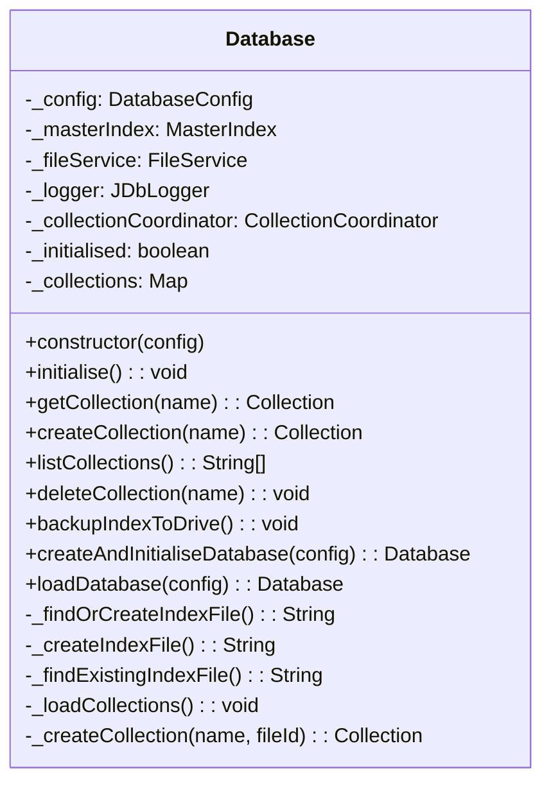
```mermaid
classDiagram
    class Database {
        -_config: DatabaseConfig
        -_masterIndex: MasterIndex
        -_fileService: FileService
        -_logger: JDbLogger
        -_collectionCoordinator: CollectionCoordinator
        -_initialised: boolean
        -_collections: Map
        +constructor(config)
        +initialise(): void
        +getCollection(name): Collection
        +createCollection(name): Collection
        +listCollections(): String[]
        +deleteCollection(name): void
        +backupIndexToDrive(): void
    +createAndInitialiseDatabase(config): Database
    +loadDatabase(config): Database
        -_findOrCreateIndexFile(): String
        -_createIndexFile(): String
        -_findExistingIndexFile(): String
        -_loadCollections(): void
        -_createCollection(name, fileId): Collection
    }
```

### DatabaseConfig Class Diagram

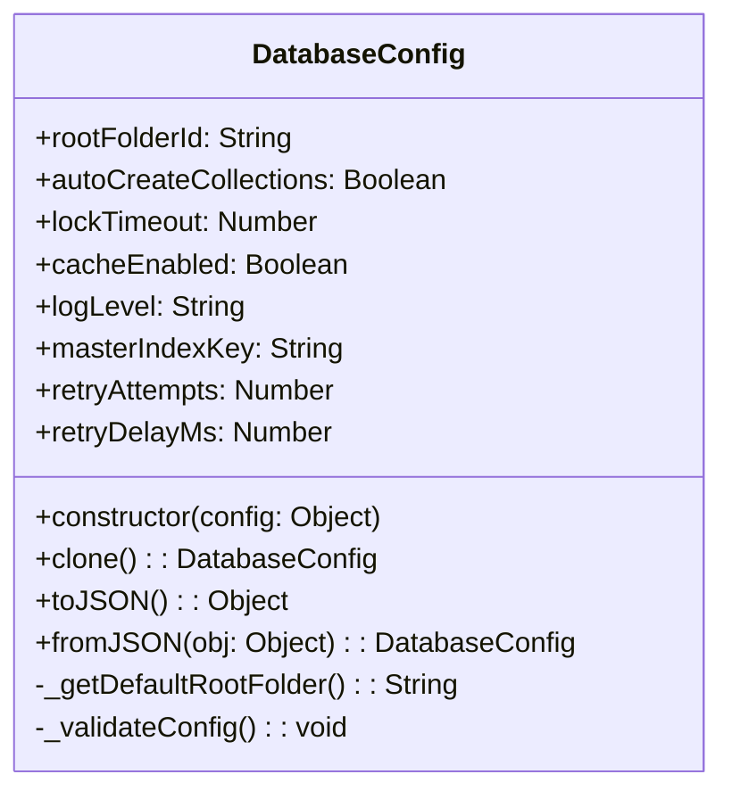
```mermaid
classDiagram
    class DatabaseConfig {
        +rootFolderId: String
        +autoCreateCollections: Boolean
        +lockTimeout: Number
        +cacheEnabled: Boolean
        +logLevel: String
        +masterIndexKey: String
        +retryAttempts: Number
        +retryDelayMs: Number
        +constructor(config: Object)
        +clone(): DatabaseConfig
        +toJSON(): Object
        +fromJSON(obj: Object): DatabaseConfig
        -_getDefaultRootFolder(): String
        -_validateConfig(): void
    }
```

### Collection Facade and Operations

The `Collection` class acts as a facade, delegating operations to specialized handler classes.

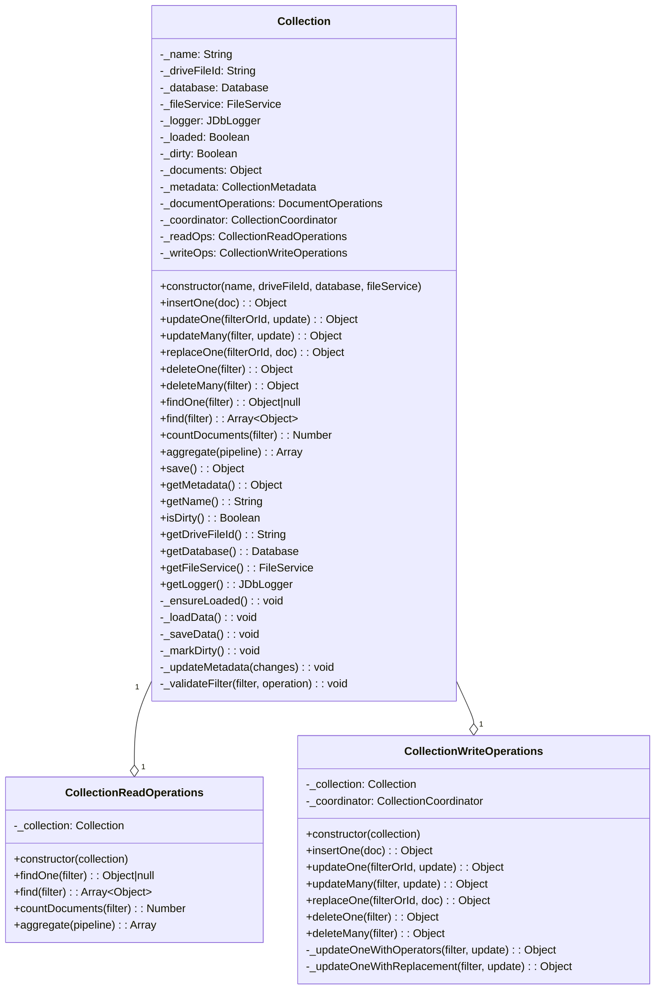
```mermaid
classDiagram
    Collection "1" --o "1" CollectionReadOperations
    Collection "1" --o "1" CollectionWriteOperations

    class Collection {
        -_name: String
        -_driveFileId: String
        -_database: Database
        -_fileService: FileService
        -_logger: JDbLogger
        -_loaded: Boolean
        -_dirty: Boolean
        -_documents: Object
        -_metadata: CollectionMetadata
        -_documentOperations: DocumentOperations
        -_coordinator: CollectionCoordinator
        -_readOps: CollectionReadOperations
        -_writeOps: CollectionWriteOperations
        +constructor(name, driveFileId, database, fileService)
        +insertOne(doc): Object
        +updateOne(filterOrId, update): Object
        +updateMany(filter, update): Object
        +replaceOne(filterOrId, doc): Object
        +deleteOne(filter): Object
        +deleteMany(filter): Object
        +findOne(filter): Object|null
        +find(filter): Array~Object~
        +countDocuments(filter): Number
        +aggregate(pipeline): Array
        +save(): Object
        +getMetadata(): Object
        +getName(): String
        +isDirty(): Boolean
        +getDriveFileId(): String
        +getDatabase(): Database
        +getFileService(): FileService
        +getLogger(): JDbLogger
        -_ensureLoaded(): void
        -_loadData(): void
        -_saveData(): void
        -_markDirty(): void
        -_updateMetadata(changes): void
        -_validateFilter(filter, operation): void
    }

    class CollectionReadOperations {
        -_collection: Collection
        +constructor(collection)
        +findOne(filter): Object|null
        +find(filter): Array~Object~
        +countDocuments(filter): Number
        +aggregate(pipeline): Array
    }

    class CollectionWriteOperations {
        -_collection: Collection
        -_coordinator: CollectionCoordinator
        +constructor(collection)
        +insertOne(doc): Object
        +updateOne(filterOrId, update): Object
        +updateMany(filter, update): Object
        +replaceOne(filterOrId, doc): Object
        +deleteOne(filter): Object
        +deleteMany(filter): Object
        -_updateOneWithOperators(filter, update): Object
        -_updateOneWithReplacement(filter, update): Object
    }
```

### DocumentOperations Class Diagram

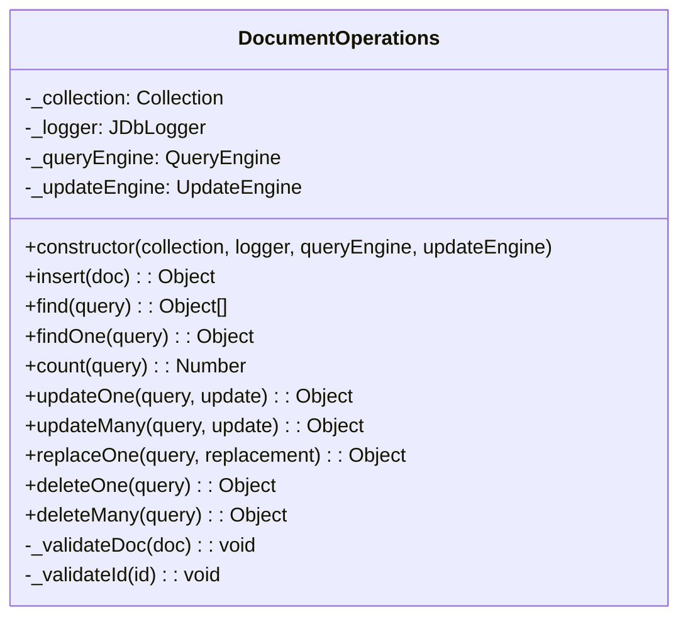
```mermaid
classDiagram
    class DocumentOperations {
        -_collection: Collection
        -_logger: JDbLogger
        -_queryEngine: QueryEngine
        -_updateEngine: UpdateEngine
        +constructor(collection, logger, queryEngine, updateEngine)
        +insert(doc): Object
        +find(query): Object[]
        +findOne(query): Object
        +count(query): Number
        +updateOne(query, update): Object
        +updateMany(query, update): Object
        +replaceOne(query, replacement): Object
        +deleteOne(query): Object
        +deleteMany(query): Object
        -_validateDoc(doc): void
        -_validateId(id): void
    }
```

### CollectionMetadata Class Diagram

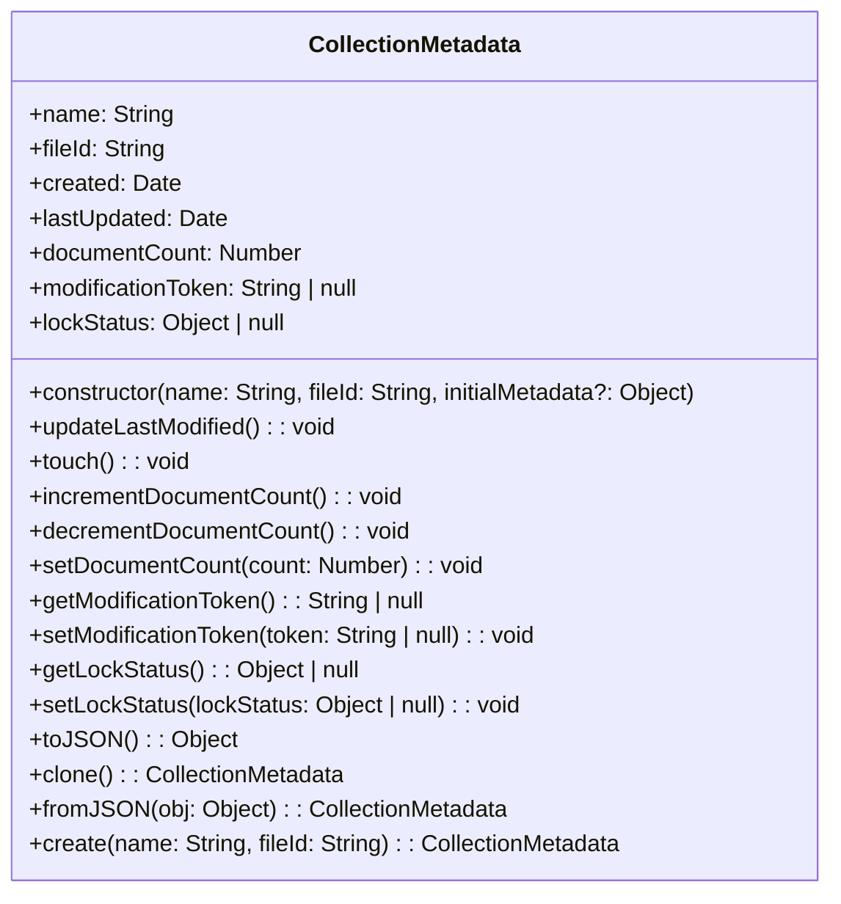
```mermaid
classDiagram
    class CollectionMetadata {
        +name: String
        +fileId: String
        +created: Date
        +lastUpdated: Date
        +documentCount: Number
        +modificationToken: String | null
        +lockStatus: Object | null
        +constructor(name: String, fileId: String, initialMetadata?: Object)
        +updateLastModified(): void
        +touch(): void
        +incrementDocumentCount(): void
        +decrementDocumentCount(): void
        +setDocumentCount(count: Number): void
        +getModificationToken(): String | null
        +setModificationToken(token: String | null): void
        +getLockStatus(): Object | null
        +setLockStatus(lockStatus: Object | null): void
        +toJSON(): Object
        +clone(): CollectionMetadata
        +fromJSON(obj: Object): CollectionMetadata
        +create(name: String, fileId: String): CollectionMetadata
    }
```

### FileService Class Diagram

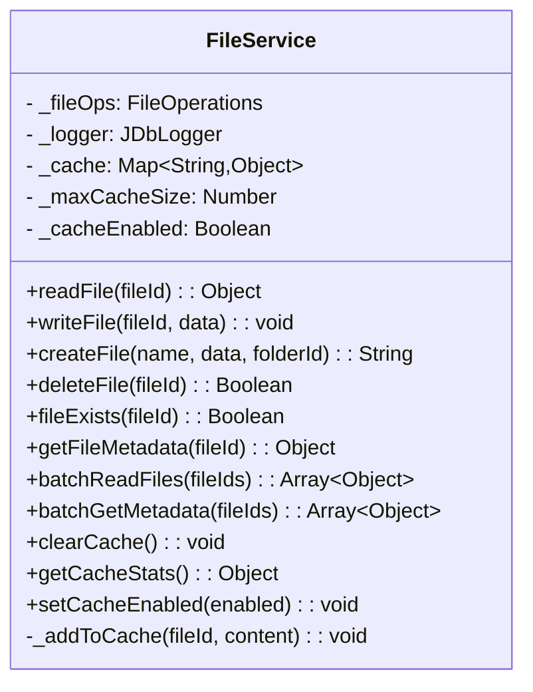
```mermaid
classDiagram
    class FileService {
        - _fileOps: FileOperations
        - _logger: JDbLogger
        - _cache: Map~String,Object~
        - _maxCacheSize: Number
        - _cacheEnabled: Boolean
        +readFile(fileId): Object
        +writeFile(fileId, data): void
        +createFile(name, data, folderId): String
        +deleteFile(fileId): Boolean
        +fileExists(fileId): Boolean
        +getFileMetadata(fileId): Object
        +batchReadFiles(fileIds): Array~Object~
        +batchGetMetadata(fileIds): Array~Object~
        +clearCache(): void
        +getCacheStats(): Object
        +setCacheEnabled(enabled): void
        -_addToCache(fileId, content): void
    }
```

### FileOperations Class Diagram

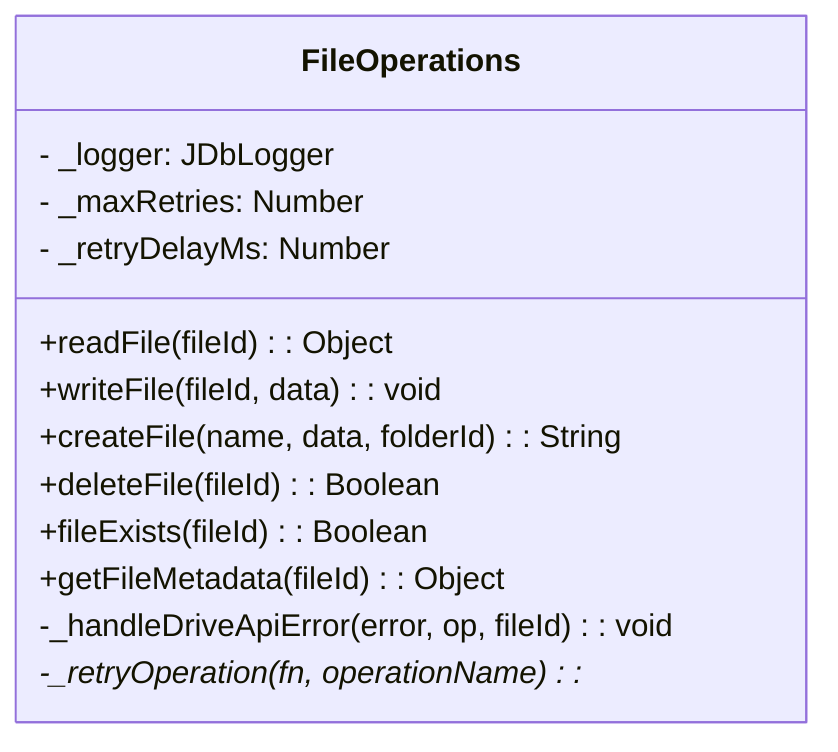
```mermaid
classDiagram
    class FileOperations {
        - _logger: JDbLogger
        - _maxRetries: Number
        - _retryDelayMs: Number
        +readFile(fileId): Object
        +writeFile(fileId, data): void
        +createFile(name, data, folderId): String
        +deleteFile(fileId): Boolean
        +fileExists(fileId): Boolean
        +getFileMetadata(fileId): Object
        -_handleDriveApiError(error, op, fileId): void
        -_retryOperation(fn, operationName): *
    }
```

### QueryEngine

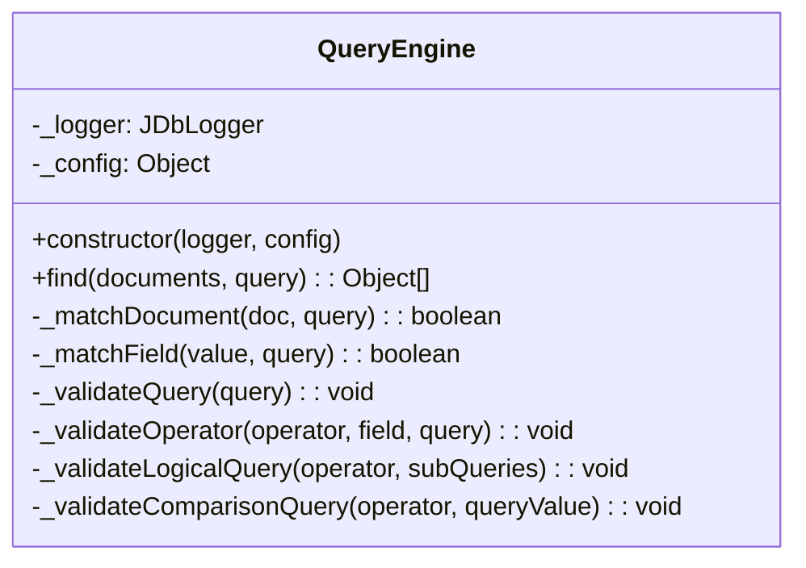
```mermaid
classDiagram
  class QueryEngine {
    -_logger: JDbLogger
    -_config: Object
    +constructor(logger, config)
    +find(documents, query): Object[]
    -_matchDocument(doc, query): boolean
    -_matchField(value, query): boolean
    -_validateQuery(query): void
    -_validateOperator(operator, field, query): void
    -_validateLogicalQuery(operator, subQueries): void
    -_validateComparisonQuery(operator, queryValue): void
  }
```

### UpdateEngine Class Diagram

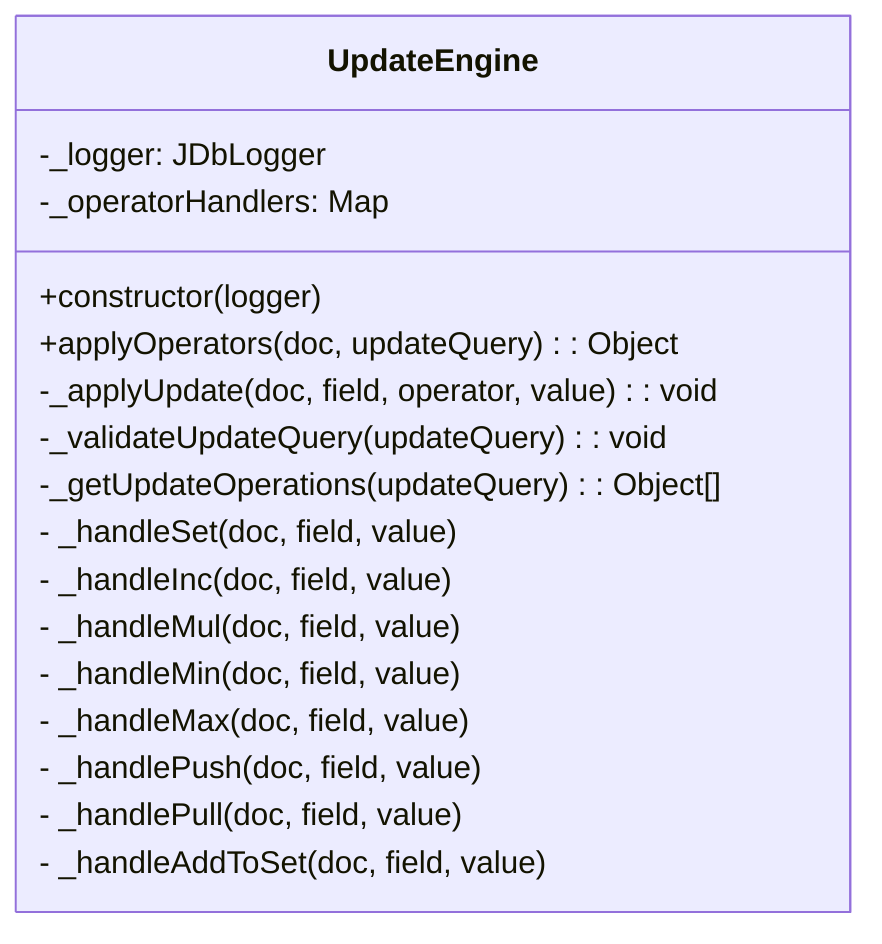
```mermaid
classDiagram
  class UpdateEngine {
    -_logger: JDbLogger
    -_operatorHandlers: Map
    +constructor(logger)
    +applyOperators(doc, updateQuery): Object
    -_applyUpdate(doc, field, operator, value): void
    -_validateUpdateQuery(updateQuery): void
    -_getUpdateOperations(updateQuery): Object[]
    - _handleSet(doc, field, value)
    - _handleInc(doc, field, value)
    - _handleMul(doc, field, value)
    - _handleMin(doc, field, value)
    - _handleMax(doc, field, value)
    - _handlePush(doc, field, value)
    - _handlePull(doc, field, value)
    - _handleAddToSet(doc, field, value)
  }
```

### IdGenerator Class Diagram

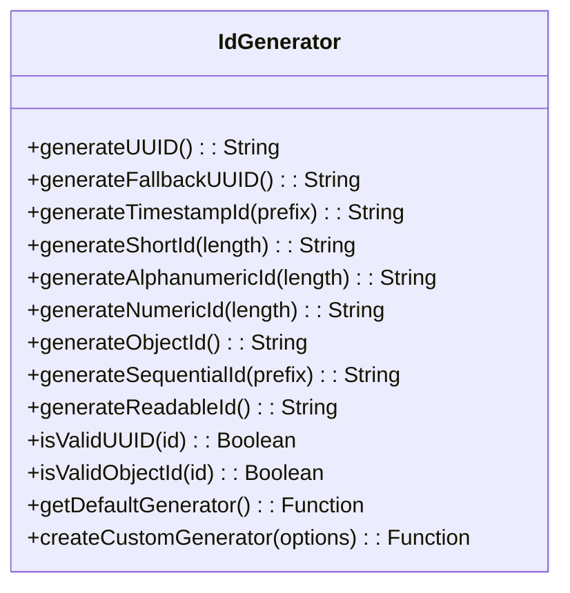
```mermaid
classDiagram
    class IdGenerator {
        +generateUUID(): String
        +generateFallbackUUID(): String
        +generateTimestampId(prefix): String
        +generateShortId(length): String
        +generateAlphanumericId(length): String
        +generateNumericId(length): String
        +generateObjectId(): String
        +generateSequentialId(prefix): String
        +generateReadableId(): String
        +isValidUUID(id): Boolean
        +isValidObjectId(id): Boolean
        +getDefaultGenerator(): Function
        +createCustomGenerator(options): Function
    }
```

### DbLockService Class Diagram

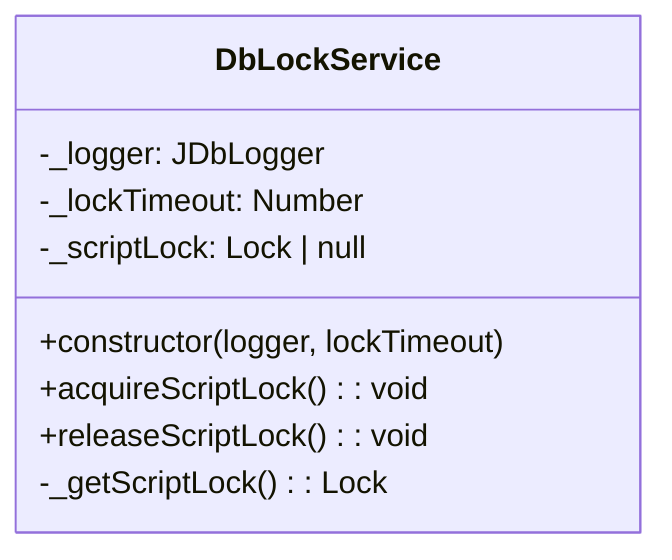
```mermaid
classDiagram
    class DbLockService {
        -_logger: JDbLogger
        -_lockTimeout: Number
        -_scriptLock: Lock | null
        +constructor(logger, lockTimeout)
        +acquireScriptLock(): void
        +releaseScriptLock(): void
        -_getScriptLock(): Lock
    }
```

### JDbLogger Class Diagram

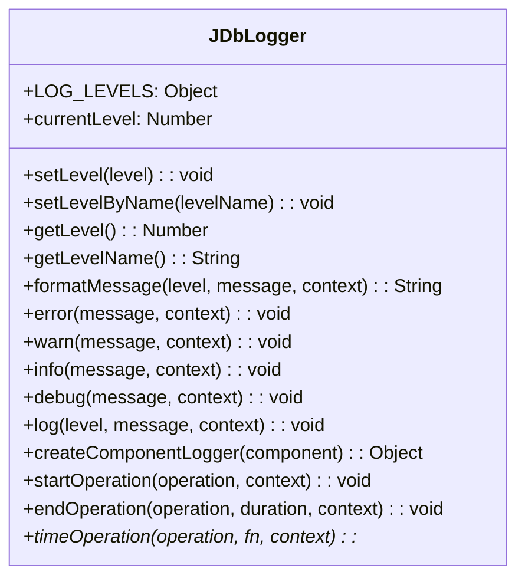
```mermaid
classDiagram
    class JDbLogger {
        +LOG_LEVELS: Object
        +currentLevel: Number
        +setLevel(level): void
        +setLevelByName(levelName): void
        +getLevel(): Number
        +getLevelName(): String
        +formatMessage(level, message, context): String
        +error(message, context): void
        +warn(message, context): void
        +info(message, context): void
        +debug(message, context): void
        +log(level, message, context): void
        +createComponentLogger(component): Object
        +startOperation(operation, context): void
        +endOperation(operation, duration, context): void
        +timeOperation(operation, fn, context): *
    }
```

### ErrorHandler Class Diagram

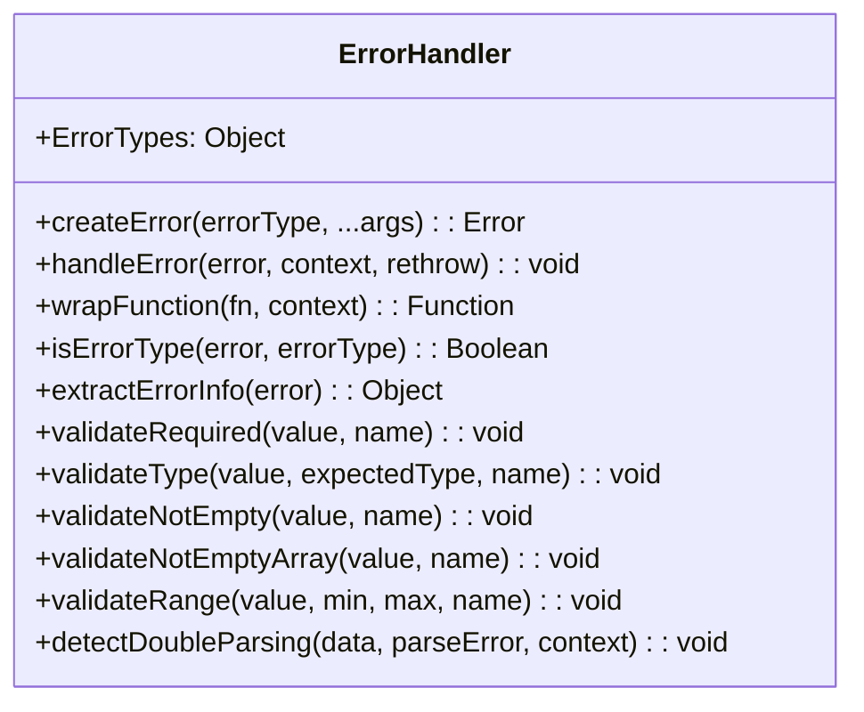
```mermaid
classDiagram
    class ErrorHandler {
        +ErrorTypes: Object
        +createError(errorType, ...args): Error
        +handleError(error, context, rethrow): void
        +wrapFunction(fn, context): Function
        +isErrorType(error, errorType): Boolean
        +extractErrorInfo(error): Object
        +validateRequired(value, name): void
        +validateType(value, expectedType, name): void
        +validateNotEmpty(value, name): void
        +validateNotEmptyArray(value, name): void
        +validateRange(value, min, max, name): void
        +detectDoubleParsing(data, parseError, context): void
    }
```

### JsonDbError Class Diagram

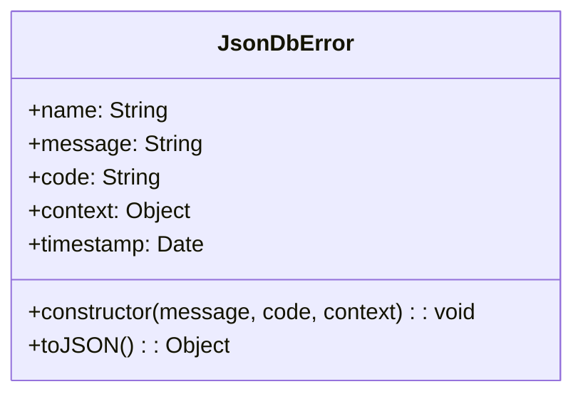
```mermaid
classDiagram
    class JsonDbError {
        +name: String
        +message: String
        +code: String
        +context: Object
        +timestamp: Date
        +constructor(message, code, context): void
        +toJSON(): Object
    }
```

### Specific Error Classes

```mermaid
classDiagram
    JsonDbError <|-- ConfigurationError
    JsonDbError <|-- InvalidArgumentError
    JsonDbError <|-- DatabaseStateError
    JsonDbError <|-- FileIOError
    JsonDbError <|-- FileNotFoundError
    JsonDbError <|-- MasterIndexError
    JsonDbError <|-- CollectionNotFoundError
    JsonDbError <|-- DocumentNotFoundError
    JsonDbError <|-- DuplicateKeyError
    JsonDbError <|-- InvalidQueryError
    JsonDbError <|-- UpdateOperationError
    JsonDbError <|-- LockTimeoutError
    JsonDbError <|-- ConflictError
    JsonDbError <|-- OperationError
    JsonDbError <|-- SerializationError
    JsonDbError <|-- DeserializationError

    class ConfigurationError { +constructor(message) }
    class InvalidArgumentError { +constructor(argName, value, message) }
    class DatabaseStateError { +constructor(message) }
    class FileIOError { +constructor(operation, fileId, message) }
    class FileNotFoundError { +constructor(fileId) }
    class MasterIndexError { +constructor(message) }
    class CollectionNotFoundError { +constructor(collectionName) }
    class DocumentNotFoundError { +constructor(query, collectionName) }
    class DuplicateKeyError { +constructor(key, value) }
    class InvalidQueryError { +constructor(message) }
    class UpdateOperationError { +constructor(message) }
    class LockTimeoutError { +constructor(lockName, timeout) }
    class ConflictError { +constructor(message) }
    class OperationError { +constructor(message) }
    class SerializationError { +constructor(message) }
    class DeserializationError { +constructor(message) }
```

### MasterIndex Class Diagram

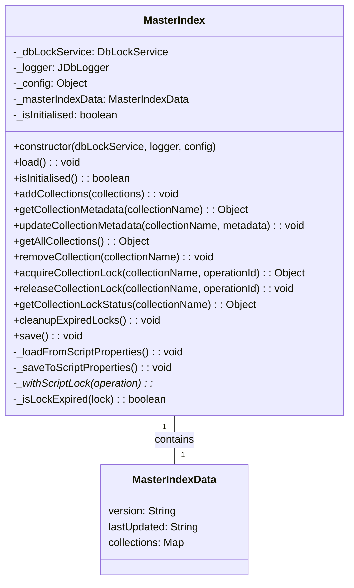
```mermaid
classDiagram
    class MasterIndex {
        -_dbLockService: DbLockService
        -_logger: JDbLogger
        -_config: Object
        -_masterIndexData: MasterIndexData
        -_isInitialised: boolean
        +constructor(dbLockService, logger, config)
        +load(): void
        +isInitialised(): boolean
        +addCollections(collections): void
        +getCollectionMetadata(collectionName): Object
        +updateCollectionMetadata(collectionName, metadata): void
        +getAllCollections(): Object
        +removeCollection(collectionName): void
        +acquireCollectionLock(collectionName, operationId): Object
        +releaseCollectionLock(collectionName, operationId): void
        +getCollectionLockStatus(collectionName): Object
        +cleanupExpiredLocks(): void
        +save(): void
        -_loadFromScriptProperties(): void
        -_saveToScriptProperties(): void
        -_withScriptLock(operation): *
        -_isLockExpired(lock): boolean
    }

    class MasterIndexData {
        version: String
        lastUpdated: String
        collections: Map
    }

    MasterIndex "1" -- "1" MasterIndexData : contains
```

## Class Relationships

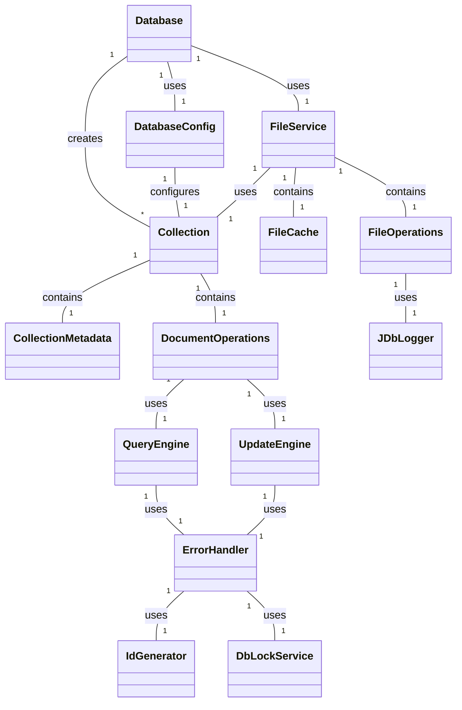
```mermaid
classDiagram
    Database "1" -- "1" DatabaseConfig : uses
    Database "1" -- "*" Collection : creates
    DatabaseConfig "1" -- "1" Collection : configures
    Collection "1" -- "1" CollectionMetadata : contains
    Collection "1" -- "1" DocumentOperations : contains
    DocumentOperations "1" -- "1" QueryEngine : uses
    DocumentOperations "1" -- "1" UpdateEngine : uses
    QueryEngine "1" -- "1" ErrorHandler : uses
    UpdateEngine "1" -- "1" ErrorHandler : uses
    ErrorHandler "1" -- "1" IdGenerator : uses
    ErrorHandler "1" -- "1" DbLockService : uses
    Database "1" -- "1" FileService : uses
    FileService "1" -- "1" Collection : uses
    FileService "1" -- "1" FileCache : contains
    FileService "1" -- "1" FileOperations : contains
    FileOperations "1" -- "1" JDbLogger : uses
```

## Sequence Diagrams

### Document Operation Sequence

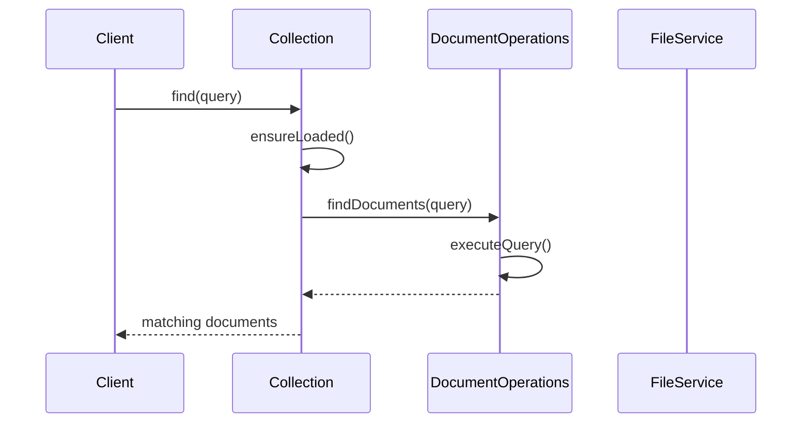
```mermaid
sequenceDiagram
    participant Client
    participant Collection
    participant DocumentOperations
    participant FileService

    Client->>Collection: find(query)
    Collection->>Collection: ensureLoaded()
    Collection->>DocumentOperations: findDocuments(query)
    DocumentOperations->>DocumentOperations: executeQuery()
    DocumentOperations-->>Collection:
    Collection-->>Client: matching documents
```

### File Operation Sequence

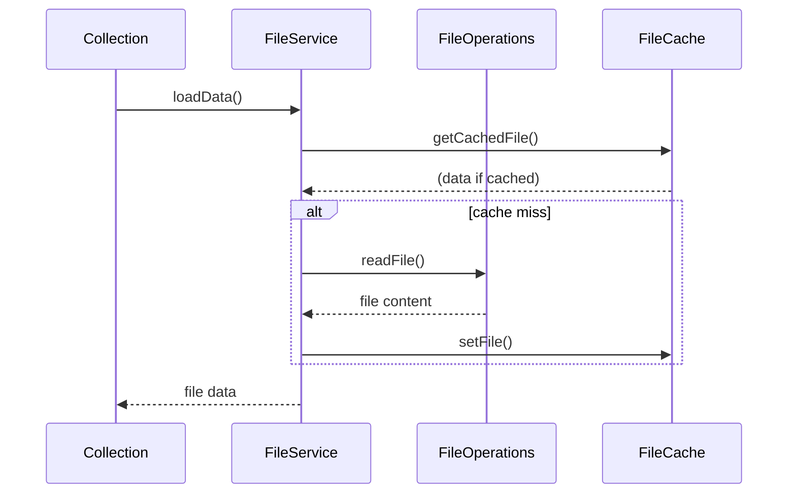
```mermaid
sequenceDiagram
    participant C as Collection
    participant FS as FileService
    participant FO as FileOperations
    participant FC as FileCache

    C->>FS: loadData()
    FS->>FC: getCachedFile()
    FC-->>FS: (data if cached)
    alt cache miss
        FS->>FO: readFile()
        FO-->>FS: file content
        FS->>FC: setFile()
    end
    FS-->>C: file data
```
